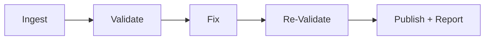
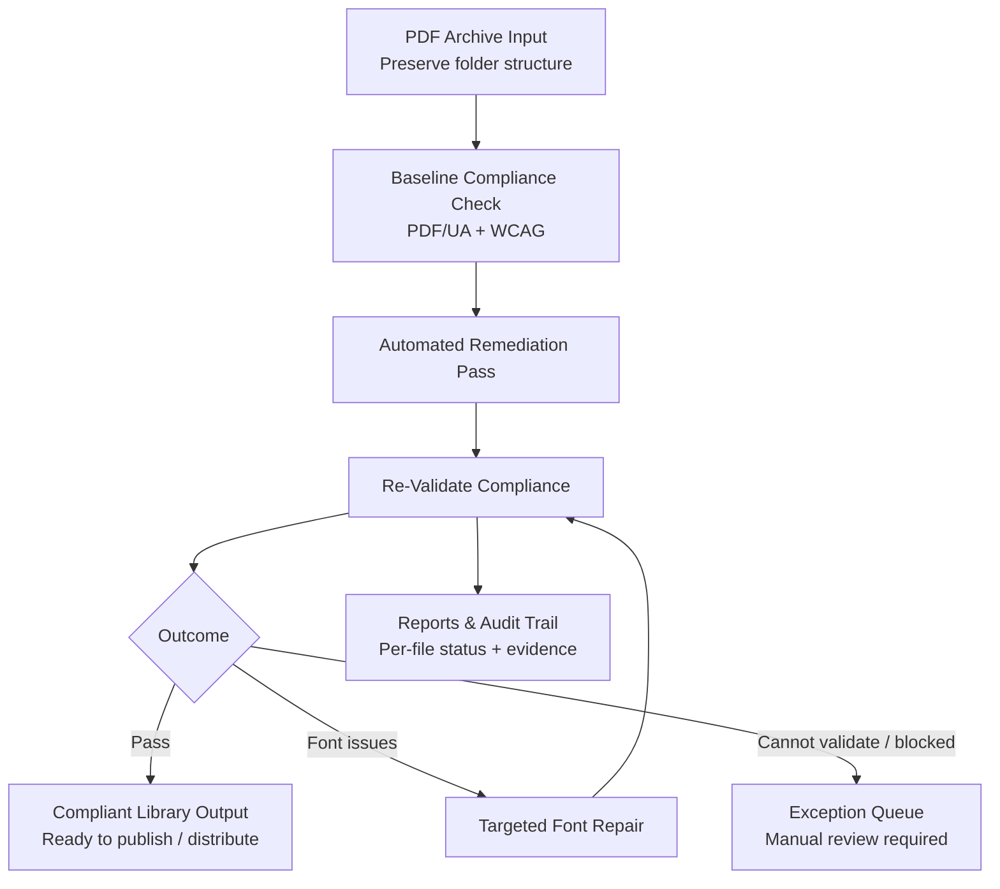
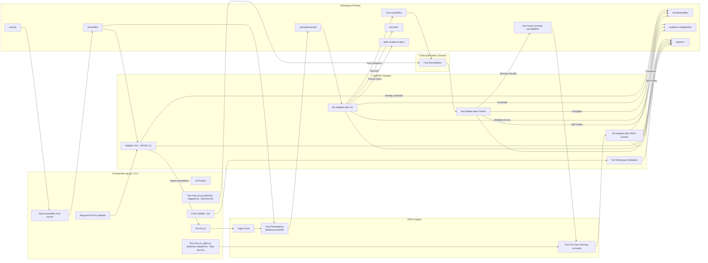
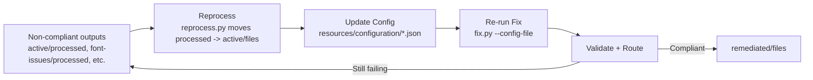

# PDF Remediation Tool



Think of this as a production line for accessibility: you feed it a sprawling PDF archive, and it spits back a compliant set without wrecking your folder structure. Under the hood it wires veraPDF and PDFix together to validate and remediate thousands of files fast, with the original layout intact.


## Quickstart



1) Install uv
   - macOS/Linux:
     `curl -LsSf https://astral.sh/uv/install.sh | sh`
   - Windows PowerShell:
     `powershell -ExecutionPolicy ByPass -c "irm https://astral.sh/uv/install.ps1 | iex"`

     (For Windows, you may need to install VC++ Redistributable: https://learn.microsoft.com/en-us/cpp/windows/latest-supported-vc-redist?view=msvc-170#latest-supported-redistributable-version)
2) Install Java (required for veraPDF validation).
3) Set the PDFix license in `.env`:
   ```
   PDFIX_LICENSE_NAME="your-name"
   PDFIX_LICENSE_KEY="your-key"
   ```

   Check if the license is valid:
   ```
   uv run license
   ```

4) Install Docker Desktop (required for Callas/PDFix Docker font-fix steps).
   The tool now attempts to launch Docker Desktop automatically if it is not running.
5) Save the Callas license in `resources/font/.env`

## Single-PDF pipeline (`pdf_api`)

`src/pdf_api` runs the same sequence as `go.py` for **one PDF**, with no
project/workspace folder tree. In goes a PDF; out come the remediated PDF and a
before and after validation report.

```bash
uv run pdf-api                       # http://127.0.0.1:8100
```

```python
from pathlib import Path

from pdf_api.pipeline import process_pdf
from pdf_api.models import PipelineOptions

result = process_pdf(Path("in.pdf"), Path("out/"),
                     PipelineOptions(config_file="default.json"))
print(result.status, result.before, result.after)
```

The HTTP API accepts the same options as a multipart form payload:

```bash
curl -X POST http://127.0.0.1:8100/api/pdf \
  -F 'file=@in.pdf;type=application/pdf' \
  -F 'config_file=default.json' \
  -F 'wcag_and_ua1_must_pass=false' \
  -F 'attempt_font_fix=true' \
  -F 'attempt_unlock=true'
```

The `202 Accepted` response contains a job payload that can be polled with
`GET /api/pdf/{job_id}`:

```json
{
  "job_id": "8e4f2a9b7c1d4e6f8a0b2c3d4e5f6a7b",
  "original_name": "in.pdf",
  "state": "queued",
  "created_at": "2026-08-28T12:00:00",
  "stages": [],
  "error": null
}
```

When processing finishes, the same payload includes a `result` object. The
artifacts are available at `/api/pdf/{job_id}/pdf`, `/before`, and `/after`:

```json
{
  "job_id": "8e4f2a9b7c1d4e6f8a0b2c3d4e5f6a7b",
  "original_name": "in.pdf",
  "state": "done",
  "created_at": "2026-08-28T12:00:00",
  "stages": [],
  "error": null,
  "result": {
    "status": "remediated",
    "input_pdf_path": "/tmp/in.pdf",
    "output_pdf_path": "/tmp/out/in.pdf",
    "before": {},
    "after": {},
    "stages": [],
    "warnings": [],
    "diagnostics": [],
    "error": null
  }
}
```

The sequence: validate, short-circuit if already compliant, unlock if encrypted,
apply the chosen configuration, repair fonts with Callas and then PDFix if the
`7.21.x` clauses call for it, apply targeted configurations for specific failing
clause-tests, validate again. `go.py`'s `reprocess` step has no equivalent — it
exists only to sweep files between workspace folders.

Everything intermediate lives in a temporary directory that is removed before
the call returns, and the input file is never modified. A single file completes
in **2-5 seconds** rather than the ~40s the batch pipeline needs, because none
of the chunking, page counting, workspace scaffolding, or folder routing runs.

`PipelineResult.status` is `already_compliant`, `remediated`, `improved`,
`unchanged`, `failed`, or `cancelled` — outcomes rather than folder names.
Font stages are skipped with a recorded reason when Docker is unavailable, so
the pipeline still completes on a machine without it.

The HTTP surface is asynchronous because a run takes minutes: `POST /api/pdf`
returns an id, `GET /api/pdf/{id}` reports progress, and
`GET /api/pdf/{id}/{pdf,before,after}` fetches the artifacts. It has no
authentication and binds loopback by default.

## Web app

`uv run web` serves a browser front end at <http://127.0.0.1:8000>: drag and
drop PDFs, choose `default.json` or `default-slim.json`, and watch each one
progress. **One PDF is one job** — dropping twenty files creates twenty
independent jobs that succeed, fail, and are cancelled on their own. Each
offers its remediated PDF, both validation reports, and a ZIP.

It runs the `pdf_api` pipeline in-process rather than shelling out, so progress
is the pipeline's own stage list rather than text scraped from console output.
Jobs run on a worker pool: `PDF_WEB_MAX_CONCURRENT_JOBS` (default 2) bounds the
machine, and `PDF_WEB_MAX_RUNNING_JOBS_PER_USER` (default 1) stops one person
holding all of it. Queueing is unlimited; only running is capped.

```bash
uv run web
```

Expanding a job lists its pipeline stages and the failing veraPDF rules with
their clause/test identifier and description, merged across the UA1 and WCAG
profiles, for both the before and after passes.

Every job has a permanent URL (`/#job=<job-id>`), so a refresh, a bookmark, or a
shared link reopens the run with its results and captured log. The landing page
lists recent jobs; job directories are removed by the retention sweep described
below, and their links stop resolving at that point.

### Single-user and multi-user modes

With no configuration the app runs **single-user**: loopback only, no
authentication, every job owned by a local identity. This is the default and
needs nothing set up.

For a shared server it runs **multi-user**, delegating authentication to an
authenticating reverse proxy (oauth2-proxy, Cloudflare Access, Entra
Application Proxy) that terminates TLS and SSO and forwards the signed-in user
in a header. The app never handles OAuth flows, passwords, or sessions.

```bash
export PDF_WEB_PROXY_SECRET="$(openssl rand -hex 32)"   # also set on the proxy
uv run web --host 0.0.0.0 --allow-remote
```

| Variable | Default | Purpose |
|---|---|---|
| `PDF_WEB_PROXY_SECRET` | unset | Shared secret proving a request came through the proxy. |
| `PDF_WEB_TRUSTED_PROXY_IPS` | unset | Source addresses or CIDRs allowed to assert an identity. |
| `PDF_WEB_PROXY_SECRET_HEADER` | `x-pdf-web-proxy-secret` | Header carrying the shared secret. |
| `PDF_WEB_IDENTITY_HEADER` | `x-forwarded-email` | Header(s) carrying the authenticated user; comma-separated, first present wins. |
| `PDF_WEB_DEV_USER` | `local` | Identity used in single-user mode. |
| `PDF_WEB_LEGACY_JOB_OWNER` | unset | Owner assigned to job directories created before ownership existed. |
| `PDF_WEB_HEADER_DIAGNOSTIC` | unset | Exposes `/api/proxy-headers` for diagnosing a deployment. Leave off in normal use. |
| `PDF_WEB_MAX_JOBS_PER_USER` | `1` | Jobs one user may have queued or running at once. |

**Proof of origin is the entire security model.** The app decides who you are by
reading a header, and a header is only trustworthy if clients cannot set it
themselves. Setting either `PDF_WEB_PROXY_SECRET` or
`PDF_WEB_TRUSTED_PROXY_IPS` enables multi-user mode; if both are set, both must
pass. The app refuses to bind a non-loopback interface unless one is
configured, and single-user mode additionally refuses non-loopback clients.

Which proof to use depends on the proxy. Use the **shared secret** where the
proxy can inject arbitrary headers, such as oauth2-proxy. Use the **source
allowlist** where it cannot, such as Microsoft Entra Application Proxy, whose
connector is the only host able to reach the application — see
[docs/deployment-entra-app-proxy.md](docs/deployment-entra-app-proxy.md).

When a deployment does not authenticate as expected, set
`PDF_WEB_HEADER_DIAGNOSTIC=1` and read `/api/proxy-headers`. It reports the
source address, which identity headers arrived, and whether the request would
authenticate, with credential values redacted. It is deliberately reachable
without authenticating, so turn it off when finished; the server warns on every
start while it is enabled.

Jobs are **private to whoever submitted them**. Another user's job returns 404
rather than 403, so job identifiers cannot be probed for existence, and a job
link shared with a colleague will not open for them — the job view says so.

Job directories that predate ownership are unreachable in multi-user mode
unless `PDF_WEB_LEGACY_JOB_OWNER` names an owner; in single-user mode they
belong to the local user. The server reports how many such jobs it found on
startup, so they are not a silent surprise.

### Trying multi-user locally

A browser cannot set the identity header on a normal navigation, so exercising
multi-user mode by hand needs something in front that injects it — exactly what
the proxy does in production. `scripts/dev_identity_proxy.py` is a throwaway
stand-in: run one per person, each on its own port, then open each port in a
separate browser window to be several people at once.

```bash
uv sync --all-groups                                  # the tool needs the dev deps

PDF_WEB_PROXY_SECRET=s3cret uv run web --port 8000    # terminal 1
uv run python scripts/dev_identity_proxy.py alice@example.com \
    --port 8101 --secret s3cret                       # terminal 2
uv run python scripts/dev_identity_proxy.py bob@example.com \
    --port 8102 --secret s3cret                       # terminal 3
```

Then browse <http://127.0.0.1:8101> as Alice and <http://127.0.0.1:8102> as
Bob. Each sees only their own jobs, the per-user queue cap applies to each
separately, and pasting one person's job link into the other's window shows the
privacy message rather than the job.

The proxy streams both directions, so uploads and the live pipeline log work
through it. **It authenticates nobody** — it asserts whichever identity you
name on the command line, which is the whole point. Never run it in front of a
deployment others can reach.

### Queueing

The pipeline runs one job at a time: veraPDF forks a JVM per file across every
CPU, the font-fix steps drive Docker through module-global state, and PDFix
activates its licence per process. Running two pipelines on one machine would
thrash rather than go faster.

So the queue is fair rather than parallel. Each user may have
`PDF_WEB_MAX_JOBS_PER_USER` jobs in flight (one by default); a further
submission is refused with 409 rather than queued behind their own work. A
waiting job shows how many jobs will run before it, and is told when that
number changes. Only the count is exposed, never whose jobs they are.

Each submission becomes a throwaway project under `resources/web-jobs/<job-id>/`
with its own `PROJECT_BASE_PATH`, so web runs never touch `resources/projects/`.
Uploads are seeded into the job's `source/` folder before `go.py` starts, which
is what keeps the Terminus download path from firing. Job directories are swept
after `PDF_WEB_JOB_TTL_HOURS` (default 72).

A running or queued job can be cancelled from the job view. The pipeline's
process group is signalled, so the veraPDF and PDFix child processes are reaped
rather than orphaned, whatever partial results exist are still harvested and
downloadable, and the submitter's queue slot is freed immediately. Without this
a mistaken batch would hold its owner's only slot and block everyone queued
behind it until it finished.

`GET /healthz` is an unauthenticated liveness probe for supervisors and load
balancers. It reports only whether the process is up and the worker thread is
running, returning 503 if the worker has stopped — a live process with a dead
worker accepts jobs it will never run. Everything revealing (licences, tooling,
identity configuration) stays behind authentication on `/api/health`.

The app binds `127.0.0.1` by default. Options: `--port`, `--host`,
`--allow-remote`, `--reload`. See *Single-user and multi-user modes* above
before exposing it beyond loopback.

The environment banner checks Java, the veraPDF jar, the configuration files,
Docker, and the PDFix and Callas licenses. Java or the jar missing disables
submission outright, because veraPDF failures are silent — every file would be
reported as unvalidatable while the pipeline still exits successfully. When
Docker is unreachable, "Skip font fix" is enabled automatically, since steps 3
and 4 would otherwise abort the run before the final validation.

## Run the full workflow with one command

```bash
uv run go delnorte
```

`go.py` orchestrates a required pre-fix `validate --skip-page-count` on
`active/files`, immediately moves files that meet the configured compliance
gate to `remediated/files`, then runs `fix`, optional `font_fix` +
`font_fix_pdfix` (`--skip-font-fix`), reprocesses all workspace folders back
into `active/files`, runs `fix_target` on `active` with
`5-1:restore_metadata.json` and `7.1-9:restore_metadata.json`, and finishes
with `validate --full --skip-page-count`.
It also initializes missing projects automatically. Pass
`--wcag-and-ua1-must-pass` to make the pre-fix gate and remediation stages
move files to `remediated/` only when both veraPDF `wcag` and `ua1` pass. By
default, those stages still route files based on `wcag` only. The
`--pre-validate` flag is accepted only for backwards compatibility because
pre-fix validation now always runs.

If `source/` is empty, `go.py` can automatically download and extract the
live files backup from Pantheon into `source/`.

Requirement: Terminus must be installed and already configured/authenticated.

### To run the same pipeline for multiple projects sequentially:

```bash
uv run readyset delnorte alameda sonoma
```

`readyset` runs `fleet.py go`, which runs `go.py` once per project in the
order provided, prints a high-visibility banner for each project, and stops on
the first non-zero exit code. It also accepts `--wcag-and-ua1-must-pass` and
forwards that strict pre-fix and remediated-file requirement to each project run.

### To run reprocess across all projects sequentially:

```bash
uv run fleet reprocess
```

`fleet.py` runs `reprocess.py` once per project under
`resources/projects`, prints a high-visibility banner for each project, and
stops on the first non-zero exit code.

### To run debug triage across all projects and aggregate clause folders:

```bash
uv run fleet debug
```

`fleet.py` runs `debug.py` for each project and moves each project's
clause folders into `resources/debug/_files/<clause-test>/<project>/`.

## Walkthrough

Here's an example walkthrough of remediating the Del Norte trial court.



1) Initialize a project:
   ```
   uv run init delnorte
   ```
2) Copy PDFs into `resources/projects/delnorte/source`.
3) Validate the PDFs to establish a baseline.
   ```
   uv run validate delnorte
   ```
4) Remediate PDFs:
   ```
   uv run fix delnorte
   ```
5) If font issues are flagged, run Callas font remediation:
   ```
   uv run font_fix delnorte
   ```
6) After Callas, run the PDFix missing-unicode font fix on any remaining font issues:
   ```
   uv run font_fix_pdfix delnorte
   ```
7) Run the fallback remediation on pdf's that were not remediated in #4.

   a. Queue the files for re-processing (default scans all workspace
   subfolders that contain a `processed/` directory):
   ```
   uv run reprocess delnorte
   ```

   b. Remediate with the fallback configuration.
   ```
   uv run fix delnorte --config-file=default-fallback.json
   ```
8) Run the fallback remediation on the files with remaining font issues.
   
   a. Queue the files for re-processing:
   ```
   uv run reprocess delnorte default font-issues
   ```
   Use `font-issues-missing-unicode` instead of `font-issues` if you are
   reprocessing the PDFix font pass.

   b. Remediate with the fallback configuration (`reprocess` returns files to
   `active/files`, so run `fix` on `active`, which is the default):
   ```
   uv run fix delnorte --config-file=default-fallback.json
   ```

9) Check the workspace status:
   ```
   uv run status delnorte
   ```

10) Review the reports:
    - Standard validation/remediation runs:
      `resources/projects/<project>/workspace/<workspace>/<folder>/reports/<timestamp>-<directory>`
    - Full workspace validation runs (`validate --full`):
      `resources/projects/<project>/workspace/<workspace>/reports/<timestamp>-full`

11) Remediated files will be located in:
    `resources/projects/<project>/workspace/remediated/<folder>`

## Process Flow

High-level view of the end-to-end pipeline: initialize, validate, remediate, re-validate, and route results into the right workspace folders.

### Initialize and Validate

Bootstrap a project and get a clean baseline before remediation begins.

#### 1) Initialize a project
```
uv run init <project_name>
```

Copy PDFs into the printed `resources/projects/<project>/source` directory.

#### 2) Validate PDFs
```
uv run validate <project_name> [workspace] [folder] [directory] [--full] [--skip-page-count]
```

For ad-hoc validation of a single PDF, use [pdfaudit.org](https://www.pdfaudit.org/).
It explains accessibility issues in plain language and is useful for quick spot checks outside the full pipeline.

Defaults:
- `workspace` = `default`
- `folder` = `active`
- `directory` = `files`
You can target any workspace/subfolder/directory by passing these arguments.
By default, validation runs against `<workspace>/<folder>/<directory>`.

Use `--full` to validate all PDFs in every workspace subfolder's `files/` and
`processed/` directories in one pass. This mode writes reports to
`workspace/<workspace>/reports/<timestamp>-full` and prints the scanned folders.
`--full` skips these operational subfolders: `pdfix-cannot-process`,
`secured-cannot-process`, `secured-needs-approval`, `reports`,
`pdfix-unable-to-open`, `unable-to-validate`, and `unable-to-process`.
Use `--skip-page-count` to skip the PDFix page count pass and run only veraPDF.

Validation runs both PDF/UA (veraPDF `ua1`) and the modified WCAG 2.2
profile `WCAG-2-2-Complete-JCC.xml` by default.
Results include `ua1` and `wcag` columns in `vera_validation_results.csv`, and
per-profile report folders under `reports/<timestamp>-<directory>` (for example,
`xml/ua1`, `xml/wcag`, `summary/ua1`, `summary/wcag`). To change profiles, edit
the `profiles` list in `src/pdf_remediation/utilities/verapdf.py`.

If the `active/files` folder is empty, the system copies PDFs from `source/`
into `active/files` once and creates `.remediation.lock`.

### Fix and Reprocess

Run remediation, then loop back for another pass when you have a better config.



#### 1) Remediate PDFs
```
uv run fix <project_name> [workspace] [folder]
```

Use `workspace` and `folder` to remediate a specific subfolder in the project.

For verbose progress and file-level visibility (useful for spotting blocking files), run:
`uv run fix <project_name> [workspace] [folder] --verbose`
Tune processing with:
- `--chunk-size <n>` to control batch size (default: 500)
- `--n-cpu <n>` to control parallel workers (default: 4)
- `--debug` to set `--verbose` and `--chunk-size 1` so you can spot a slow file
- `--wcag-and-ua1-must-pass` to move files to `remediated/` only when both
  `wcag` and `ua1` pass validation (default remains `wcag` only)

Steps executed:
1. Apply the skip lists (`skipped_files.txt` and `pdfix-cannot-process-files.csv`) to exclude problematic files.
2. Count pages for each PDF (PDFix).
3. Check for secured PDFs; classify and route them, then exclude them from remediation.
   - `secured-cannot-process/files`: secured PDFs with font violations that cannot be remediated.
   - `secured-needs-approval/files`: secured PDFs without blocking font violations (manual approval needed).
   - `pdfix-unable-to-open/files`: PDFs that PDFix cannot open.
4. Split files into size buckets for parallel remediation.
5. Remediate with PDFix, write to `active/processed/`.
6. Validate all processed files with veraPDF.
7. Move compliant files into `remediated/files`.
   - Default: move files when `wcag` passes.
   - Optional: pass `--wcag-and-ua1-must-pass` to require both `wcag` and `ua1`.
8. Move validation-error files into `unable-to-validate/files` and log them to
   `unable-to-validate.csv` in the project root.
9. Move font-violation failures into `font-issues/files`.

If remediation is interrupted, rerunning `Fix` resumes from the remaining files.
Runs end with a workspace summary showing totals plus `files`/`processed`
breakdowns.

For clause-test-specific remediation, use `fix_target`:
```
uv run -m pdf_remediation.fix_target <project_name> [workspace] [folder] --targets <clause-test:action.json> [<clause-test:action.json> ...] [--skip-final-full-validation] [--wcag-and-ua1-must-pass]
```

Example:
```
uv run -m pdf_remediation.fix_target delnorte --targets 3.1-42:action1.json 4.2-2:action1.json 7.1-9:action2.json
```

`fix_target` does the following:
1. Validate every PDF in `<workspace>/<folder>/files`.
2. Match each file's failing VERA clause-test IDs against `--targets`.
3. Run the matching PDFix action JSONs in CLI order.
4. If multiple matched clause-tests point to the same action JSON, run that action once for that PDF.
5. Write remediation output to `<workspace>/<folder>/processed`.
6. Validate every PDF currently in `<workspace>/<folder>/processed`.
7. Move validation-passing files to `remediated/files`; files that still fail remain in `processed`.
   By default, `wcag` passing is enough. Pass `--wcag-and-ua1-must-pass` to require both `wcag` and `ua1`.
8. Unless `--skip-final-full-validation` is passed, run a final `validate --full --skip-page-count` pass for the workspace.

Target action files must exist under `resources/configuration/`.

#### 2) Fix font issues (Callas)
```
uv run font_fix <project_name> [workspace] [folder]
```

`FontFix` targets the `font-issues` folder by default, runs Callas pdfToolbox
inside Docker on those files, then re-validates and routes results into
`remediated/` or `unable-to-validate/`.
Runs end with a workspace summary showing totals plus `files`/`processed`
breakdowns.
Missing-unicode violations detected after validation are moved to
`font-issues-missing-unicode/` for the PDFix pass.
By default, `wcag` passing is enough to move files to `remediated/`. Pass
`--wcag-and-ua1-must-pass` to require both `wcag` and `ua1`.

Callas file-level failures (error codes 104-107) are logged to
`callas_font_fix_errors.csv` in the project root.

Options:
- `--chunk-size <n>` to control batch size (default: 500)
- `--verbose` to list files in each chunk
- `--debug` to set `--verbose` and `--chunk-size 1` so you can spot a slow file
- `--wcag-and-ua1-must-pass` to move files to `remediated/` only when both
  `wcag` and `ua1` pass

#### 3) Fix missing-unicode font issues (PDFix)
```
uv run font_fix_pdfix <project_name> [workspace] [folder]
```

Run this after `FontFix` to process files moved into `font-issues-missing-unicode`.
It uses PDFix font remediation via Docker, re-validates, and routes results into
`remediated/` or `unable-to-validate/`.
By default, `wcag` passing is enough to move files to `remediated/`. Pass
`--wcag-and-ua1-must-pass` to require both `wcag` and `ua1`.

PDFix file-level failures are logged to `pdfix-font-errors.csv` in the project root.

Options:
- `--chunk-size <n>` to control batch size (default: 500)
- `--n-cpu <n>` to control parallel workers (default: all cores)
- `--verbose` to list files in each chunk
- `--debug` to set `--verbose` and `--chunk-size 1` so you can spot a slow file
- `--wcag-and-ua1-must-pass` to move files to `remediated/` only when both
  `wcag` and `ua1` pass

#### 4) Reprocess with a new configuration
```
uv run reprocess <project_name> [workspace] [folder]
```

Defaults:
- `workspace` = `default`
- `folder` = `all`

`reprocess` scans `<workspace>/<folder>/processed` and moves any PDFs back to
`active/files`. When `folder` is `all`, it scans every workspace subfolder with
a `processed/` directory.

Update
`resources/configuration/default.json` (or swap in a new config),
then re-run `Fix`.

```
uv run fix <project_name> [workspace] active --config-file [new-config.json]
```

`new-config.json` is located in `resources/configuration`

For font-issue retries, run reprocess with `font-issues` as the folder,
update the config, then re-run `Fix` on `active` (default folder). Run `FontFix` to
attempt automatic font remediation with Callas pdfToolbox, then follow with
`font_fix_pdfix` on `font-issues-missing-unicode`.

To skip a blocking file before reprocessing, run:
`uv run -m pdf_remediation.skip <project_name> <relative_file_path>`

### Workspace Control

Use these controls to reset or fork clean workspaces without touching your originals.

#### 1) Get latest source PDFs into `active/files`
```
uv run -m pdf_remediation.get_latest_files <project_name> [workspace]
uv run fleet get_latest_files <project_name> [project_name ...] [--workspace-name <workspace>] [--exclude-sites <site> [<site> ...]]
```

`get_latest_files` does the following:
- If Terminus is installed, it clears `<project>/source` and downloads the latest live files backup.
- If Terminus is not installed, it skips download and uses the current `source/` contents.
- Scans only PDF files from `source/`.
- Compares by relative path against all workspace `<folder>/files` and `<folder>/processed` PDFs.
- Ignores workspace `debug/` and `reports/` folders during this comparison.
- Copies only new PDFs into `<workspace>/active/files`, preserving relative paths.

#### 2) Reset workspace
```
uv run reset <project_name> [workspace] [folder]
```

Clears `active/files` and `active/processed`, then re-copies files from `source/`
and resets `.remediation.lock`.

Use a new `workspace` name here to create a fresh workspace seeded from
`source/` without affecting existing workspaces.

## Infrastructure

### Runtime and dependencies
- Python package targeting `>=3.14` (see `pyproject.toml`).
- Java runtime is required for veraPDF validation (used by the JAR in `lib/`).
- PDFix SDK (`pdfix-sdk`) provides remediation and license operations.
- `parallelbar` is used for multiprocessing progress and job dispatch.
- `pandas` is used to summarize validation results and write CSV reports.
- Callas pdfToolbox runs in Docker for `FontFix` font remediation.

### External tools and assets
- `lib/greenfield-apps-1.28.0.jar`: veraPDF validation tool invoked by
  `src/pdf_remediation/utilities/verapdf.py`.
- `resources/configuration/default.json`: PDFix command profile applied
  during remediation.
- `resources/configuration/WCAG-2-2-Complete-JCC.xml`: default veraPDF WCAG
  profile used alongside `ua1` (see the section below for the JCC-specific
  rule changes; adjust the `profiles` list in
  `src/pdf_remediation/utilities/verapdf.py` to change this).
- `resources/configuration/UA1-Font.xml`: optional narrowed veraPDF profile for
  font-only checks.
- `resources/font/.env`: Callas pdfToolbox license config for `FontFix`.

### WCAG-2-2-Complete-JCC.xml
`resources/configuration/WCAG-2-2-Complete-JCC.xml` is a modified version of
the veraPDF WCAG Validation profile. This repository uses it as the default
`wcag` profile in `src/pdf_remediation/utilities/verapdf.py`.

Compared with the base WCAG Validation profile, this JCC variant removes:
- `1.3.4-1`: Pages shall have the same orientation.
- `1.4.8-1`: Document should not contain illegible font.

### Directory layout
- `src/pdf_remediation/`: CLI entry points and orchestration scripts.
- `src/pdf_remediation/utilities/`: shared functions for remediation, validation,
  project paths, and report generation.
- `resources/projects/`: per-project workspace root (default, can be overridden
  with `PROJECT_BASE_PATH`).

To store projects on a different disk, set `PROJECT_BASE_PATH` in `.env`:
```
PROJECT_BASE_PATH="/Volumes/ExternalDrive/pdf-remediation-projects"
```

### Project workspace structure
The workspace structure is created on demand by `resources.py`:

```
resources/projects/<project>/
  source/                # user-provided original PDFs
  workspace/<workspace>/ # defaults to "default"
    reports/<ts>-full    # optional consolidated reports from "validate --full"
    active/
      files/             # working set copied from source
      processed/         # remediation output
      reports/<ts>-<directory>  # validation reports for a run
      .remediation.lock  # semaphore to avoid repeated copy
    remediated/
      files/             # validated, compliant PDFs
    font-issues/
      files/             # font-related validation failures
    font-issues-missing-unicode/
      files/             # missing-unicode font issues after Callas validation
    unable-to-validate/
      files/             # PDFs that failed validation after remediation
    debug/
      <clause>/...       # copies of failed active/files PDFs grouped by clause
    secured-cannot-process/
      files/             # secured PDFs with blocking font violations
    secured-needs-approval/
      files/             # secured PDFs without blocking font violations
    pdfix-unable-to-open/
      files/             # PDFs that PDFix cannot open
```
Subfolder names are not fixed. `Fix` and `Validate` accept a `workspace_folder`
argument so you can run separate workflows in different subfolders (for example,
`active`, `remediated`, or a custom name).

## Commands

Project scripts can be run directly with `uv run <script>`:
- `uv run license`
- `uv run init ...`
- `uv run validate ...`
- `uv run fix ...`
- `uv run font_fix ...`
- `uv run font_fix_pdfix ...`
- `uv run go ...`
- `uv run readyset ...`
- `uv run fleet ...`
- `uv run reprocess ...`
- `uv run reset ...`
- `uv run status ...`
- `uv run web ...`

### Single-PDF security removal

Use `solo-remove-security` to save an unsecured copy of one PDF that PDFix can
open with an empty password:

```bash
uv run solo-remove-security input.pdf output.pdf
```

The command never changes the input file and emits a JSON result. It does not
accept or recover non-empty passwords. Already-unsecured PDFs are copied
unchanged. When a secured PDF contains digital signature fields, the command
removes security and warns that saving the output invalidates those signatures.
Before opening the PDF, the command passes the `PDFIX_LICENSE_NAME` and
`PDFIX_LICENSE_KEY` values from `.env` to PDFix account authorization. Pass
`--compact` for one-line JSON.

### Pipeline orchestration
- `go.py` runs the remediation pipeline in sequence:
  1) required pre-fix validate (`--skip-page-count`) on `active/files`; files
     that meet the configured compliance gate move immediately to `remediated/files`
  2) `fix` on `active`
  3) optional `font_fix` on `font-issues` (skipped by `--skip-font-fix`)
  4) optional `font_fix_pdfix` on `font-issues-missing-unicode` (skipped by `--skip-font-fix`)
  5) `reprocess` on all folders back to `active/files`
  6) `fix_target` on `active` with `--targets 5-1:restore_metadata.json 7.1-9:restore_metadata.json`
  7) final `validate --full --skip-page-count`
- Syntax:
  `uv run go <project_name> [workspace] [--config-file <file>] [--chunk-size <n>] [--n-cpu <n>] [--pre-validate] [--skip-font-fix] [--wcag-and-ua1-must-pass] [--verbose] [--debug]`
- If the project does not exist, `go.py` runs `init` automatically.
- If `source/` is empty and Terminus is installed/configured, `go.py` can
  download and extract the live files backup into `source/`.
- `--wcag-and-ua1-must-pass` is forwarded to `fix.py`, `font_fix.py`,
  `font_fix_pdfix.py`, and the `go.py` `fix_target` stage. It also controls
  the required pre-fix validation gate. By default, files move to
  `remediated/files` when `wcag` passes; with the flag they require both
  `wcag` and `ua1`.
- `--pre-validate` is deprecated and has no effect; pre-fix validation is
  required and always runs.
- `readyset` runs `fleet.py go`, which runs `go.py` sequentially across
  multiple projects.
- Syntax:
  `uv run readyset <project_name> [project_name ...] [--workspace-name <workspace>] [--config-file <file>] [--chunk-size <n>] [--n-cpu <n>] [--pre-validate] [--skip-font-fix] [--wcag-and-ua1-must-pass] [--verbose] [--debug] [--exclude-sites <site> [<site> ...]]`
- `fleet.py go` is the explicit fleet subcommand for the same workflow.
- Syntax:
  `uv run fleet go <project_name> [project_name ...] [--workspace-name <workspace>] [--config-file <file>] [--chunk-size <n>] [--n-cpu <n>] [--pre-validate] [--skip-font-fix] [--wcag-and-ua1-must-pass] [--verbose] [--debug] [--exclude-sites <site> [<site> ...]]`
- `fleet.py go` exits immediately if any project run fails and returns that
  same exit code.
- `fleet.py get_latest_files` runs `get_latest_files.py` sequentially across all
  projects (or selected projects).
- Syntax:
  `uv run fleet get_latest_files [project_name ...] [--workspace-name <workspace>] [--exclude-sites <site> [<site> ...]]`
- `fleet.py fix_target` runs `fix_target.py` sequentially across all projects
  (or selected projects).
- Syntax:
  `uv run fleet fix_target [project_name ...] [--workspace-name <workspace>] [--workspace-folder <folder>] --targets <clause-test:action.json> [<clause-test:action.json> ...] [--n-cpu <n>] [--verbose] [--debug] [--skip-final-full-validation] [--wcag-and-ua1-must-pass] [--exclude-sites <site> [<site> ...]]`
- `fleet.py` runs `get_latest_files.py`, `init.py`, `status.py`, `validate.py`,
  `reprocess.py`, `debug.py`, or `fix_target.py` sequentially across all
  projects (or selected projects).
- Syntax:
  `uv run fleet <action> [project_name ...] [action options]`
- Shared filter:
  `--exclude-sites <site> [<site> ...]` (alias: `--exclude-projects`; comma-separated values also supported)
- Actions:
  `go`, `get_latest_files`, `init`, `status`, `validate`, `reprocess`, `debug`, `fix_target`
- `reprocess` exits immediately if any project run fails and returns that same
  exit code.
- `debug` runs across all projects (or selected projects), then moves each
  project's clause folders into
  `resources/debug/_files/<clause-test>/<project>/`.

### Initialization
- `init.py` bootstraps a project workspace and prints the source path for ingest.

### Validation
- `validate.py` runs page counting (PDFix) and veraPDF validation for PDF/UA
  (`ua1`) plus the modified WCAG 2.2 JCC profile
  (`WCAG-2-2-Complete-JCC.xml`).
- Default mode validates one directory (`<workspace>/<folder>/<directory>`).
- `--full` mode validates every `<subfolder>/files` and `<subfolder>/processed`
  directory in the workspace and writes a consolidated report under
  `workspace/<workspace>/reports/<timestamp>-full`.
- In `--full` mode, these subfolders are ignored:
  `pdfix-cannot-process`, `secured-cannot-process`, `secured-needs-approval`,
  `reports`, `pdfix-unable-to-open`, `unable-to-validate`, and
  `unable-to-process`.
- `--full` prints a `FOLDERS SCANNED` list before validation starts.
- `--skip-page-count` skips PDFix page counting and runs only veraPDF validation.
- Results feed the reporting pipeline in `reports/<timestamp>-<directory>`.

### Debug triage
- `debug.py` validates `active/files`, then copies every non-compliant file into
  clause-specific folders under `workspace/<workspace>/debug/<clause>/`.
- Debug copies are flattened by filename (source relative folders are not preserved).
- Files with multiple failing clauses are copied into each matching clause folder.
- Files with validation errors but no clause metadata are copied into
  `workspace/<workspace>/debug/unknown/`.
- Existing contents of `workspace/<workspace>/debug/` are cleared before each run.
- Syntax:
  `uv run -m pdf_remediation.debug <project_name> [workspace]`
- `fleet.py debug` runs `debug.py` for each project and aggregates outputs under
  `resources/debug/_files/<clause-test>/<project>/`.
- Syntax:
  `uv run fleet debug [project_name ...] [--workspace-name <workspace>] [--clause-tests <clause-test> [<clause-test> ...]] [--exclude-sites <site> [<site> ...]]`

### Remediation
- `fix.py` runs the PDFix remediation profile (e.g., `default.json`) with
  multiprocessing and preserves folder structure.
- Post-validation routes outputs to `remediated/` and moves font-issue files to
  `font-issues/`.
- By default, `fix.py` moves files to `remediated/` when `wcag` passes.
- Pass `--wcag-and-ua1-must-pass` to require both `wcag` and `ua1` before a
  file is moved to `remediated/`.
- `fix_target.py` validates `<workspace>/<folder>/files`, applies clause-test-
  specific PDFix action JSONs from `--targets`, validates `<workspace>/<folder>/processed`,
  moves validation-passing files to `remediated/`, then optionally runs `validate --full --skip-page-count`.
- By default, `fix_target.py` moves files to `remediated/` when `wcag` passes.
- Pass `--wcag-and-ua1-must-pass` to require both `wcag` and `ua1` before a
  file is moved to `remediated/`.
- If multiple matched clause-tests use the same action JSON, `fix_target.py`
  runs that action once per PDF.
- File-level remediation failures in `fix_target.py` are logged to
  `pdfix-cannot-process-files.csv` and reported in the console, but they do not
  make the whole workflow exit non-zero.
- `fleet.py fix_target` runs that workflow sequentially across every selected
  project and exits immediately only when a project has a fatal workflow error.

### Font remediation
- `font_fix.py` runs Callas pdfToolbox via Docker on `font-issues/`, re-validates,
  then moves results to `remediated/` or `unable-to-validate/`. Missing-unicode
  files move to `font-issues-missing-unicode/`. By default, `wcag` passing is
  enough to move files to `remediated/`; `--wcag-and-ua1-must-pass` requires
  both `wcag` and `ua1`.
- `font_fix_pdfix.py` runs PDFix font remediation via Docker on
  `font-issues-missing-unicode/`, re-validates, then moves results to
  `remediated/` or `unable-to-validate/`. By default, `wcag` passing is enough
  to move files to `remediated/`; `--wcag-and-ua1-must-pass` requires both
  `wcag` and `ua1`.

### Reporting (internal function, part of Validate)
- `utilities/report.py` generates CSV/TXT/HTML report artifacts from veraPDF XML output.
- Every Validate and Fix run generates reports under `reports/<timestamp>-<directory>`
  (or `workspace/<workspace>/reports/<timestamp>-full` for `validate --full`).
- Report outputs include:
  - `vera_validation_results.csv`: per-file `ua1`/`wcag` pass/fail status and rule counts.
  - `xml/<profile>/`: raw veraPDF XML reports per file (for example, `xml/ua1`).
  - `summary/<profile>/verapdf-compliance-report.txt`: compliant vs non-compliant file list.
  - `summary/<profile>/verapdf-clause-summary.csv`: clause-level rollup across the run.
  - `summary/<profile>/verapdf-file-summary.csv`: per-file summary of violations.
  - `summary/<profile>/output.txt`: synthetic log used by HTML report generation.
  - `summary/<profile>/*.html`: human-readable compliance report.

### Reprocess
- `reprocess.py` returns processed PDFs to `active/files` so you can iterate with
  a revised configuration file.
- Defaults: `workspace=default`, `folder=all`.
- You can target one source subfolder (for example, `font-issues`) or scan all
  subfolders with `processed/` and return them to `active/files`.
- `fleet.py reprocess` runs `reprocess.py` across every project in
  `resources/projects` (or only selected projects).
- Syntax:
  `uv run fleet reprocess [project_name ...] [--workspace-name <workspace>] [--workspace-folder <folder>] [--exclude-sites <site> [<site> ...]]`

### Skip
- `skip.py` appends a problematic file to `skipped_files.txt` so it is ignored
  during processing.
- Syntax: `uv run -m pdf_remediation.skip <project_name> <relative_file_path>`
  
### Auto-skip (PDFix failures)
- Files that PDFix cannot open/process are recorded in
  `pdfix-cannot-process-files.csv` at the project root and are skipped on
  subsequent runs.

### Secured and unreadable files
- Secured PDFs are logged to `secured-files.csv` with a status column
  (`secured-cannot-process` or `secured-needs-approval`).
- PDFs that PDFix cannot open are logged to `pdfix-unable-to-open.csv`.
- PDFs that cannot be validated after remediation are logged to
  `unable-to-validate.csv` and moved to `unable-to-validate/files`.
- Secured classification runs an in-memory veraPDF pass using the WCAG 2.2
  profile and treats font violations (`7.21.4.1`, `7.21.3.2`, `7.21.4.2`) as
  blocking.

### Status
- `status.py` prints a summary of the source PDF count and per-workspace file
  counts, including totals plus `files`/`processed` breakdowns.
- Workspace totals and summaries skip the workspace-level `reports/` folder.
- Syntax: `uv run status <project_name>`

### Tally
- `tally.py` scans all project folders in `resources/projects`, reads each
  project's latest `workspace/default/reports/<timestamp-*>/summary/ua1/california-report.html`,
  extracts `Clause-Test` and `Files Affected`, and builds a Clause-Test x
  Project pivot table with summed file totals.
- Default output is `resources/artifacts/tally/YYYY-MM-DD/tally.csv`.
- It also writes `resources/artifacts/tally/YYYY-MM-DD/tally-summary.csv` from each
  project's latest `workspace/default/reports/<timestamp-*>/summary-total.csv`
  with columns: `project`, `processed total`, `passed`, `fail`, `success %`.
- It also writes `resources/artifacts/tally/YYYY-MM-DD/tally-processing-errors.csv`
  from each project's `pdfix-cannot-process-files.csv`, pivoted on the second
  column (error message) with `Total` and per-project totals.
- It also writes `resources/artifacts/tally/YYYY-MM-DD/tally-progress-report.csv`
  from each project's latest
  `workspace/default/reports/<timestamp-*>/workspace-file-count.csv`
  with columns:
  `project`, `total`, `remediated`, `Remediation %`, `partially remediated`, `broken`.
  Formulas:
  `total = Total Files - pdfix-unable-to-open`;
  `Remediation % = round((remediated / total) * 100)`;
  `partially remediated = active + font-issues + font-issues-missing-unicode + secured-cannot-process + secured-needs-approval`;
  `broken = pdfix-unable-to-open + unable-to-validate`.
- It also writes `resources/artifacts/tally/YYYY-MM-DD/tally-progress-report-pivot.csv`
  from `tally-progress-report.csv` with projects as columns, metrics as rows,
  and an `aggregate` second column. Metric labels include aggregation function:
  `total (sum)`, `remediated (sum)`, `Remediation % (avg)`,
  `partially remediated (sum)`, `broken (sum)`.
- Syntax:
  `uv run -m pdf_remediation.tally [--projects-path <path>] [--workspace <name>] [--profile <name>] [--report-file <file>] [--output <path>] [--summary-output <path>] [--processing-errors-output <path>] [--progress-report-output <path>] [--progress-report-pivot-output <path>]`

### Utility scripts
- `scripts/check_pdf_headers.py` recursively checks file headers for `%PDF-`.
- It prints total valid/invalid/unreadable counts plus up to 3 sample valid and
  3 sample invalid files.
- Invalid samples include the first 32 bytes (printable + hex) to aid triage.
- Syntax: `python3 scripts/check_pdf_headers.py <folder_path>`

### Reset
- `reset.py` refreshes a workspace from `source/` and resets the copy semaphore.

### Latest source sync
- `get_latest_files.py` refreshes source from Terminus when available, then copies
  only new PDF files from `source/` into `workspace/<workspace>/active/files`.
- New-file detection is based on each PDF's path relative to `source/`, compared
  against all `<workspace>/<folder>/files` and `<workspace>/<folder>/processed` PDFs.
- Ignores `debug/` and `reports/` workspace folders while checking existing files.
- Syntax:
  `uv run -m pdf_remediation.get_latest_files <project_name> [workspace]`
- Fleet syntax:
  `uv run fleet get_latest_files [project_name ...] [--workspace-name <workspace>] [--exclude-sites <site> [<site> ...]]`

### Licensing
- `license.py` reads license state from PDFix.
<!-- - `license_activate.py` activates a license key.
- `license_deactivate.py` deactivates an active license. -->
- `.env` supports `PDFIX_LICENSE_NAME` and `PDFIX_LICENSE_KEY` for remediation.

## Tests

```bash
uv run python -m unittest discover -s tests -t .
```

Runs in CI on every push, alongside pylint. The suite covers the pure logic
that is easy to break silently and expensive to notice:

- **Upload sanitization** — path traversal, interior-dot collapsing, and
  deduplication. Filenames are attacker-controlled and become both paths and
  report identifiers.
- **veraPDF report filename reconstruction** — `expected_xml_name` rebuilds a
  filename veraPDF composes by string-mangling a path
  (`utilities/verapdf.py:107-113`). The test re-derives that formula
  independently, so a drift breaks the build rather than silently emptying
  every violation list while the counts keep working.
- **Subprocess environment** — that `PROJECT_BASE_PATH` is overridden to the
  job directory and `PANTHEON_EMAIL` is removed, which is the guard against an
  accidental Terminus download.
- **Console output parsing** — the step banners and stop message are parsed
  from output produced by the real `print_console_*` helpers, so a formatting
  change in `pdf_remediation` fails here instead of silently freezing the
  progress stepper.
- **Validation status** — that status is read from the results CSV, since
  veraPDF writes no XML at all when validation errors and inferring from file
  presence would report those files as passing.
- **Access control** — that a forwarded identity is refused without the proxy
  secret, that every job endpoint is scoped to its owner, that refusal is
  indistinguishable from absence, and that the server refuses to bind a remote
  interface unauthenticated.

## Troubleshooting

### Find slow files in a batch
1) Press Ctrl+C to stop the current run.
2) Re-run the fix command with `--debug` (or `-d`).
3) When a file hangs, copy the file path and press Ctrl+C again.
4) Skip the file:
   ```
   uv run -m pdf_remediation.skip <project_name> <file_path>
   ```
5) Run `fix` again without `--debug`/`-d`.

## Notes and Considerations
- Remediation deletes the original file in `active/files` after successful save
  (see `PDFix.fix`), so `Reset` is the canonical way to restore originals.
- Validation and remediation use multiprocessing; `fix.py` sets spawn mode for
  compatibility.
