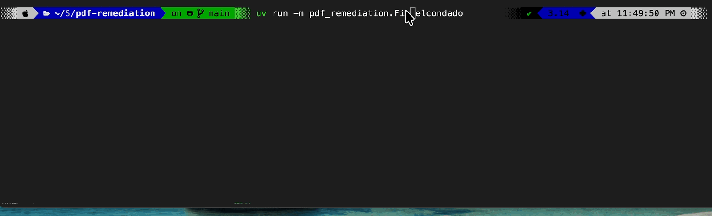
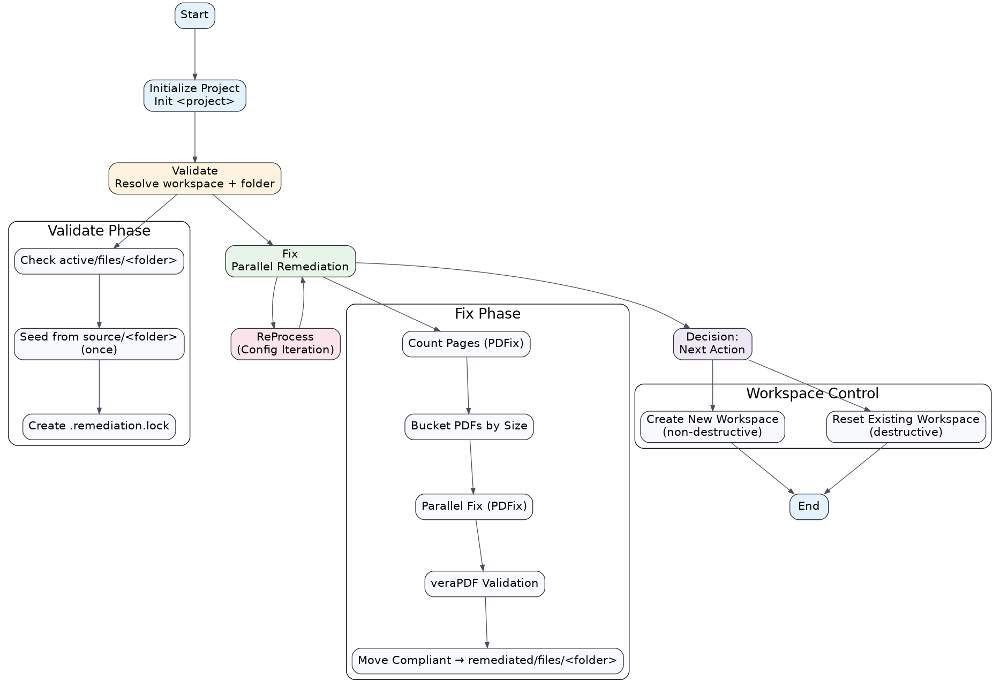
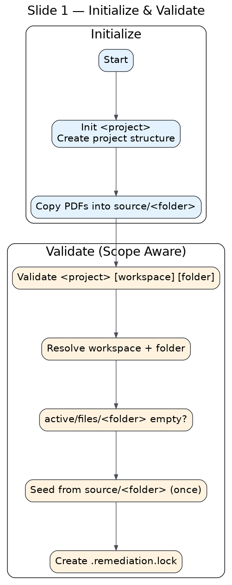
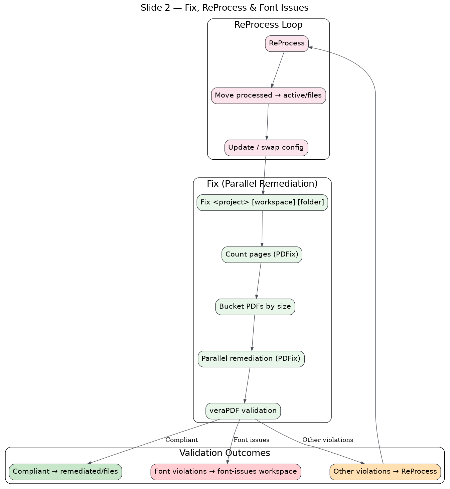
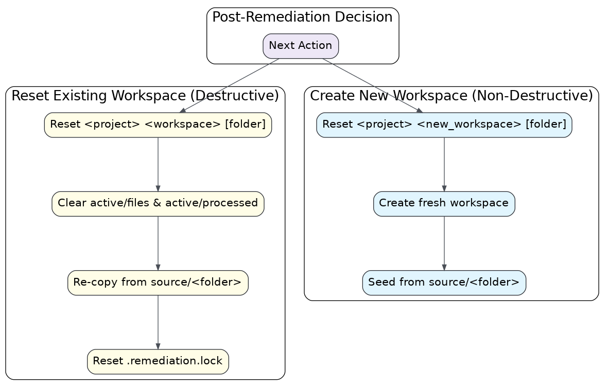

# PDF Remediation Tool

Think of this as a production line for accessibility: you feed it a sprawling PDF archive, and it spits back a compliant set without wrecking your folder structure. Under the hood it wires veraPDF and PDFix together to validate and remediate thousands of files fast, with the original layout intact.



## Quickstart

1) Install uv
   - macOS/Linux:
     `curl -LsSf https://astral.sh/uv/install.sh | sh`
   - Windows PowerShell:
     `powershell -ExecutionPolicy ByPass -c "irm https://astral.sh/uv/install.ps1 | iex"`

     (For Windows, you may need to install VC++ Redistributable: https://learn.microsoft.com/en-us/cpp/windows/latest-supported-vc-redist?view=msvc-170#latest-supported-redistributable-version)
2) Install Java (required for veraPDF validation).
3) Set the PDFix license in `.env`:
   ```
   PDFIX_LICENSE_NAME="your-name"
   PDFIX_LICENSE_KEY="your-key"
   ```

   Check if the license is valid:
   ```
   uv run -m pdf_remediation.license
   ```

4) Install Docker Desktop (required for Callas/PDFix Docker font-fix steps).
   The tool now attempts to launch Docker Desktop automatically if it is not running.
5) Save the Callas license in `resources/font/.env`

## Run the full workflow with one command

```bash
uv run -m pdf_remediation.go delnorte
```

`go.py` orchestrates `fix`, `font_fix`, `font_fix_pdfix`, and a final
`validate --full --skip-page-count` run. It also initializes missing
projects automatically.

If `source/` is empty, `go.py` can automatically download and extract the
live files backup from Pantheon into `source/`.

Requirement: Terminus must be installed and already configured/authenticated.

### To run the same pipeline for multiple projects sequentially:

```bash
uv run -m pdf_remediation.readyset delnorte alameda sonoma
```

`readyset.py` runs `go.py` once per project in the order provided, prints a
high-visibility banner for each project, and stops on the first non-zero
exit code.

## Walkthrough

Here's an example walkthrough of remediating the Del Norte trial court.

1) Initialize a project:
   ```
   uv run -m pdf_remediation.init delnorte
   ```
2) Copy PDFs into `resources/projects/delnorte/source`.
3) Validate the PDFs to establish a baseline.
   ```
   uv run -m pdf_remediation.validate delnorte
   ```
4) Remediate PDFs:
   ```
   uv run -m pdf_remediation.fix delnorte
   ```
5) If font issues are flagged, run Callas font remediation:
   ```
   uv run -m pdf_remediation.font_fix delnorte
   ```
6) After Callas, run the PDFix missing-unicode font fix on any remaining font issues:
   ```
   uv run -m pdf_remediation.font_fix_pdfix delnorte
   ```
7) Run the fallback remediation on pdf's that were not remediated in #4.

   a. Queue the files for re-processing (default scans all workspace
   subfolders that contain a `processed/` directory):
   ```
   uv run -m pdf_remediation.reprocess delnorte
   ```

   b. Remediate with the fallback configuration.
   ```
   uv run -m pdf_remediation.fix delnorte --config-file=default-fallback.json
   ```
8) Run the fallback remediation on the files with remaining font issues.
   
   a. Queue the files for re-processing:
   ```
   uv run -m pdf_remediation.reprocess delnorte default font-issues
   ```
   Use `font-issues-missing-unicode` instead of `font-issues` if you are
   reprocessing the PDFix font pass.

   b. Remediate with the fallback configuration (`reprocess` returns files to
   `active/files`, so run `fix` on `active`, which is the default):
   ```
   uv run -m pdf_remediation.fix delnorte --config-file=default-fallback.json
   ```

9) Check the workspace status:
   ```
   uv run -m pdf_remediation.status delnorte
   ```

10) Review the reports:
    - Standard validation/remediation runs:
      `resources/projects/<project>/workspace/<workspace>/<folder>/reports/<timestamp>-<directory>`
    - Full workspace validation runs (`validate --full`):
      `resources/projects/<project>/workspace/<workspace>/reports/<timestamp>-full`

11) Remediated files will be located in:
    `resources/projects/<project>/workspace/remediated/<folder>`

## Process Flow

High-level view of the end-to-end pipeline: initialize, validate, remediate, re-validate, and route results into the right workspace folders.



### Initialize and Validate

Bootstrap a project and get a clean baseline before remediation begins.



#### 1) Initialize a project
```
uv run -m pdf_remediation.init <project_name>
```

Copy PDFs into the printed `resources/projects/<project>/source` directory.

#### 2) Validate PDFs
```
uv run -m pdf_remediation.validate <project_name> [workspace] [folder] [directory] [--full] [--skip-page-count]
```

Defaults:
- `workspace` = `default`
- `folder` = `active`
- `directory` = `files`
You can target any workspace/subfolder/directory by passing these arguments.
By default, validation runs against `<workspace>/<folder>/<directory>`.

Use `--full` to validate all PDFs in every workspace subfolder's `files/` and
`processed/` directories in one pass. This mode writes reports to
`workspace/<workspace>/reports/<timestamp>-full` and prints the scanned folders.
`--full` skips these operational subfolders: `pdfix-cannot-process`,
`secured-cannot-process`, `secured-needs-approval`, `reports`,
`pdfix-unable-to-open`, `unable-to-validate`, and `unable-to-process`.
Use `--skip-page-count` to skip the PDFix page count pass and run only veraPDF.

Validation runs both PDF/UA (veraPDF `ua1`) and WCAG 2.2 profiles by default.
Results include `ua1` and `wcag` columns in `vera_validation_results.csv`, and
per-profile report folders under `reports/<timestamp>-<directory>` (for example,
`xml/ua1`, `xml/wcag`, `summary/ua1`, `summary/wcag`). To change profiles, edit
the `profiles` list in `src/pdf_remediation/utilities/verapdf.py`.

If the `active/files` folder is empty, the system copies PDFs from `source/`
into `active/files` once and creates `.remediation.lock`.

### Fix and Reprocess

Run remediation, then loop back for another pass when you have a better config.



#### 1) Remediate PDFs
```
uv run -m pdf_remediation.fix <project_name> [workspace] [folder]
```

Use `workspace` and `folder` to remediate a specific subfolder in the project.

For verbose progress and file-level visibility (useful for spotting blocking files), run:
`uv run -m pdf_remediation.fix <project_name> [workspace] [folder] --verbose`
Tune processing with:
- `--chunk-size <n>` to control batch size (default: 500)
- `--n-cpu <n>` to control parallel workers (default: 4)
- `--debug` to set `--verbose` and `--chunk-size 1` so you can spot a slow file

Steps executed:
1. Apply the skip lists (`skipped_files.txt` and `pdfix-cannot-process-files.csv`) to exclude problematic files.
2. Count pages for each PDF (PDFix).
3. Check for secured PDFs; classify and route them, then exclude them from remediation.
   - `secured-cannot-process/files`: secured PDFs with font violations that cannot be remediated.
   - `secured-needs-approval/files`: secured PDFs without blocking font violations (manual approval needed).
   - `pdfix-unable-to-open/files`: PDFs that PDFix cannot open.
4. Split files into size buckets for parallel remediation.
5. Remediate with PDFix, write to `active/processed/`.
6. Validate all processed files with veraPDF.
7. Move compliant files into `remediated/files`.
8. Move validation-error files into `unable-to-validate/files` and log them to
   `unable-to-validate.csv` in the project root.
9. Move font-violation failures into `font-issues/files`.

If remediation is interrupted, rerunning `Fix` resumes from the remaining files.
Runs end with a workspace summary showing totals plus `files`/`processed`
breakdowns.

#### 2) Fix font issues (Callas)
```
uv run -m pdf_remediation.font_fix <project_name> [workspace] [folder]
```

`FontFix` targets the `font-issues` folder by default, runs Callas pdfToolbox
inside Docker on those files, then re-validates and routes results into
`remediated/` or `unable-to-validate/`.
Runs end with a workspace summary showing totals plus `files`/`processed`
breakdowns.
Missing-unicode violations detected after validation are moved to
`font-issues-missing-unicode/` for the PDFix pass.

Callas file-level failures (error codes 104-107) are logged to
`callas_font_fix_errors.csv` in the project root.

Options:
- `--chunk-size <n>` to control batch size (default: 500)
- `--verbose` to list files in each chunk
- `--debug` to set `--verbose` and `--chunk-size 1` so you can spot a slow file

#### 3) Fix missing-unicode font issues (PDFix)
```
uv run -m pdf_remediation.font_fix_pdfix <project_name> [workspace] [folder]
```

Run this after `FontFix` to process files moved into `font-issues-missing-unicode`.
It uses PDFix font remediation via Docker, re-validates, and routes results into
`remediated/` or `unable-to-validate/`.

PDFix file-level failures are logged to `pdfix-font-errors.csv` in the project root.

Options:
- `--chunk-size <n>` to control batch size (default: 500)
- `--n-cpu <n>` to control parallel workers (default: all cores)
- `--verbose` to list files in each chunk
- `--debug` to set `--verbose` and `--chunk-size 1` so you can spot a slow file

#### 4) Reprocess with a new configuration
```
uv run -m pdf_remediation.reprocess <project_name> [workspace] [folder]
```

Defaults:
- `workspace` = `default`
- `folder` = `all`

`reprocess` scans `<workspace>/<folder>/processed` and moves any PDFs back to
`active/files`. When `folder` is `all`, it scans every workspace subfolder with
a `processed/` directory.

Update
`resources/configuration/default.json` (or swap in a new config),
then re-run `Fix`.

```
uv run -m pdf_remediation.fix <project_name> [workspace] active --config-file [new-config.json]
```

`new-config.json` is located in `resources/configuration`

For font-issue retries, run reprocess with `font-issues` as the folder,
update the config, then re-run `Fix` on `active` (default folder). Run `FontFix` to
attempt automatic font remediation with Callas pdfToolbox, then follow with
`font_fix_pdfix` on `font-issues-missing-unicode`.

To skip a blocking file before reprocessing, run:
`uv run -m pdf_remediation.skip <project_name> <relative_file_path>`

### Workspace Control

Use these controls to reset or fork clean workspaces without touching your originals.



#### 1) Reset workspace
```
uv run -m pdf_remediation.reset <project_name> [workspace] [folder]
```

Clears `active/files` and `active/processed`, then re-copies files from `source/`
and resets `.remediation.lock`.

Use a new `workspace` name here to create a fresh workspace seeded from
`source/` without affecting existing workspaces.

## Infrastructure

### Runtime and dependencies
- Python package targeting `>=3.14` (see `pyproject.toml`).
- Java runtime is required for veraPDF validation (used by the JAR in `lib/`).
- PDFix SDK (`pdfix-sdk`) provides remediation and license operations.
- `parallelbar` is used for multiprocessing progress and job dispatch.
- `pandas` is used to summarize validation results and write CSV reports.
- Callas pdfToolbox runs in Docker for `FontFix` font remediation.

### External tools and assets
- `lib/greenfield-apps-1.28.0.jar`: veraPDF validation tool invoked by
  `src/pdf_remediation/utilities/verapdf.py`.
- `resources/configuration/default.json`: PDFix command profile applied
  during remediation.
- `resources/configuration/WCAG-2-2-Complete.xml`: veraPDF WCAG 2.2 profile used
  alongside `ua1` by default (adjust the `profiles` list in
  `src/pdf_remediation/utilities/verapdf.py` to change this).
- `resources/configuration/UA1-Font.xml`: optional narrowed veraPDF profile for
  font-only checks.
- `resources/font/.env`: Callas pdfToolbox license config for `FontFix`.

### Directory layout
- `src/pdf_remediation/`: CLI entry points and orchestration scripts.
- `src/pdf_remediation/utilities/`: shared functions for remediation, validation,
  project paths, and report generation.
- `resources/projects/`: per-project workspace root (default, can be overridden
  with `PROJECT_BASE_PATH`).

To store projects on a different disk, set `PROJECT_BASE_PATH` in `.env`:
```
PROJECT_BASE_PATH="/Volumes/ExternalDrive/pdf-remediation-projects"
```

### Project workspace structure
The workspace structure is created on demand by `resources.py`:

```
resources/projects/<project>/
  source/                # user-provided original PDFs
  workspace/<workspace>/ # defaults to "default"
    reports/<ts>-full    # optional consolidated reports from "validate --full"
    active/
      files/             # working set copied from source
      processed/         # remediation output
      reports/<ts>-<directory>  # validation reports for a run
      .remediation.lock  # semaphore to avoid repeated copy
    remediated/
      files/             # validated, compliant PDFs
    font-issues/
      files/             # font-related validation failures
    font-issues-missing-unicode/
      files/             # missing-unicode font issues after Callas validation
    unable-to-validate/
      files/             # PDFs that failed validation after remediation
    debug/
      <clause>/...       # copies of failed active/files PDFs grouped by clause
    secured-cannot-process/
      files/             # secured PDFs with blocking font violations
    secured-needs-approval/
      files/             # secured PDFs without blocking font violations
    pdfix-unable-to-open/
      files/             # PDFs that PDFix cannot open
```
Subfolder names are not fixed. `Fix` and `Validate` accept a `workspace_folder`
argument so you can run separate workflows in different subfolders (for example,
`active`, `remediated`, or a custom name).

## Commands

### Pipeline orchestration
- `go.py` runs the remediation pipeline in sequence:
  1) pre-fix validate (`--skip-page-count`, init-only)
  2) `fix` on `active`
  3) `font_fix` on `font-issues`
  4) `font_fix_pdfix` on `font-issues-missing-unicode`
  5) final `validate --full --skip-page-count`
- Syntax:
  `uv run -m pdf_remediation.go <project_name> [workspace] [--config-file <file>] [--chunk-size <n>] [--n-cpu <n>] [--verbose] [--debug]`
- If the project does not exist, `go.py` runs `init` automatically.
- If `source/` is empty and Terminus is installed/configured, `go.py` can
  download and extract the live files backup into `source/`.
- `readyset.py` runs `go.py` sequentially across multiple projects.
- Syntax:
  `uv run -m pdf_remediation.readyset <project_name> [project_name ...]`
- `readyset.py` exits immediately if any project run fails and returns that
  same exit code.

### Initialization
- `init.py` bootstraps a project workspace and prints the source path for ingest.

### Validation
- `validate.py` runs page counting (PDFix) and veraPDF validation for PDF/UA
  (`ua1`) plus WCAG 2.2.
- Default mode validates one directory (`<workspace>/<folder>/<directory>`).
- `--full` mode validates every `<subfolder>/files` and `<subfolder>/processed`
  directory in the workspace and writes a consolidated report under
  `workspace/<workspace>/reports/<timestamp>-full`.
- In `--full` mode, these subfolders are ignored:
  `pdfix-cannot-process`, `secured-cannot-process`, `secured-needs-approval`,
  `reports`, `pdfix-unable-to-open`, `unable-to-validate`, and
  `unable-to-process`.
- `--full` prints a `FOLDERS SCANNED` list before validation starts.
- `--skip-page-count` skips PDFix page counting and runs only veraPDF validation.
- Results feed the reporting pipeline in `reports/<timestamp>-<directory>`.

### Debug triage
- `debug.py` validates `active/files`, then copies every non-compliant file into
  clause-specific folders under `workspace/<workspace>/debug/<clause>/`.
- Debug copies are flattened by filename (source relative folders are not preserved).
- Files with multiple failing clauses are copied into each matching clause folder.
- Files with validation errors but no clause metadata are copied into
  `workspace/<workspace>/debug/unknown/`.
- Existing contents of `workspace/<workspace>/debug/` are cleared before each run.
- Syntax:
  `uv run -m pdf_remediation.debug <project_name> [workspace]`

### Remediation
- `fix.py` runs the PDFix remediation profile (e.g., `default.json`) with
  multiprocessing and preserves folder structure.
- Post-validation routes outputs to `remediated/` and moves font-issue files to
  `font-issues/`.

### Font remediation
- `font_fix.py` runs Callas pdfToolbox via Docker on `font-issues/`, re-validates,
  then moves results to `remediated/` or `unable-to-validate/`. Missing-unicode
  files move to `font-issues-missing-unicode/`.
- `font_fix_pdfix.py` runs PDFix font remediation via Docker on
  `font-issues-missing-unicode/`, re-validates, then moves results to
  `remediated/` or `unable-to-validate/`.

### Reporting (internal function, part of Validate)
- `utilities/report.py` generates CSV/TXT/HTML report artifacts from veraPDF XML output.
- Every Validate and Fix run generates reports under `reports/<timestamp>-<directory>`
  (or `workspace/<workspace>/reports/<timestamp>-full` for `validate --full`).
- Report outputs include:
  - `vera_validation_results.csv`: per-file `ua1`/`wcag` pass/fail status and rule counts.
  - `xml/<profile>/`: raw veraPDF XML reports per file (for example, `xml/ua1`).
  - `summary/<profile>/verapdf-compliance-report.txt`: compliant vs non-compliant file list.
  - `summary/<profile>/verapdf-clause-summary.csv`: clause-level rollup across the run.
  - `summary/<profile>/verapdf-file-summary.csv`: per-file summary of violations.
  - `summary/<profile>/output.txt`: synthetic log used by HTML report generation.
  - `summary/<profile>/*.html`: human-readable compliance report.

### Reprocess
- `reprocess.py` returns processed PDFs to `active/files` so you can iterate with
  a revised configuration file.
- Defaults: `workspace=default`, `folder=all`.
- You can target one source subfolder (for example, `font-issues`) or scan all
  subfolders with `processed/` and return them to `active/files`.

### Skip
- `skip.py` appends a problematic file to `skipped_files.txt` so it is ignored
  during processing.
- Syntax: `uv run -m pdf_remediation.skip <project_name> <relative_file_path>`
  
### Auto-skip (PDFix failures)
- Files that PDFix cannot open/process are recorded in
  `pdfix-cannot-process-files.csv` at the project root and are skipped on
  subsequent runs.

### Secured and unreadable files
- Secured PDFs are logged to `secured-files.csv` with a status column
  (`secured-cannot-process` or `secured-needs-approval`).
- PDFs that PDFix cannot open are logged to `pdfix-unable-to-open.csv`.
- PDFs that cannot be validated after remediation are logged to
  `unable-to-validate.csv` and moved to `unable-to-validate/files`.
- Secured classification runs an in-memory veraPDF pass using the WCAG 2.2
  profile and treats font violations (`7.21.4.1`, `7.21.3.2`, `7.21.4.2`) as
  blocking.

### Status
- `status.py` prints a summary of the source PDF count and per-workspace file
  counts, including totals plus `files`/`processed` breakdowns.
- Workspace totals and summaries skip the workspace-level `reports/` folder.
- Syntax: `uv run -m pdf_remediation.status <project_name>`

### Utility scripts
- `scripts/check_pdf_headers.py` recursively checks file headers for `%PDF-`.
- It prints total valid/invalid/unreadable counts plus up to 3 sample valid and
  3 sample invalid files.
- Invalid samples include the first 32 bytes (printable + hex) to aid triage.
- Syntax: `python3 scripts/check_pdf_headers.py <folder_path>`

### Reset
- `reset.py` refreshes a workspace from `source/` and resets the copy semaphore.

### Licensing
- `license.py` reads license state from PDFix.
- `license_activate.py` activates a license key.
- `license_deactivate.py` deactivates an active license.
- `.env` supports `PDFIX_LICENSE_NAME` and `PDFIX_LICENSE_KEY` for remediation.

## Troubleshooting

### Find slow files in a batch
1) Press Ctrl+C to stop the current run.
2) Re-run the fix command with `--debug` (or `-d`).
3) When a file hangs, copy the file path and press Ctrl+C again.
4) Skip the file:
   ```
   uv run -m pdf_remediation.skip <project_name> <file_path>
   ```
5) Run `fix` again without `--debug`/`-d`.

## Notes and Considerations
- Remediation deletes the original file in `active/files` after successful save
  (see `PDFix.fix`), so `Reset` is the canonical way to restore originals.
- Validation and remediation use multiprocessing; `fix.py` sets spawn mode for
  compatibility.
