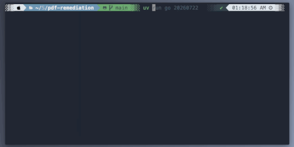
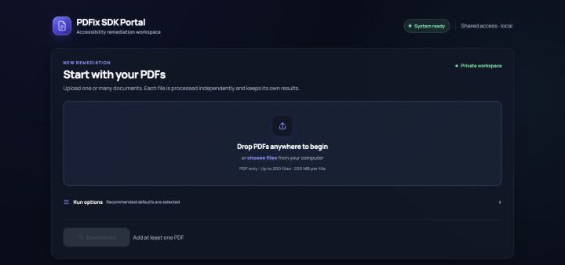
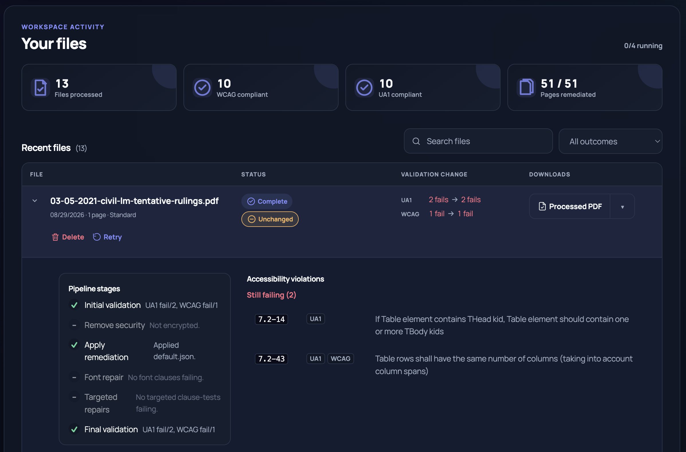
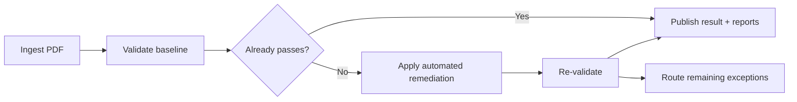

# PDF Remediation Platform

Make PDFs more accessible, from one file to an entire archive.

Validate. Remediate. Re-validate. Keep the evidence.

## Choose your workflow

| Need | Use | Start |
|---|---|---|
| Process document collections | [Bulk remediation](#bulk-remediation) | `uv run go <project>` |
| Let staff remediate on demand | [Web portal](#web-portal-for-on-demand-remediation) | `uv run web` |
| Add remediation to another system | [Integration API](#api-for-integrated-systems) | `uv run pdf-api` |

> Automated remediation does not guarantee conformance. Every run shows what
> passed, what improved, and what still needs review.

## Quickstarts

### Bulk remediation

Built for document libraries, website archives, and multi-project programs.
The batch workflow preserves directory structure, processes PDFs in chunks,
routes exceptions, and produces project-level audit reports.



```bash
# Put PDFs in resources/projects/acme/source, then run the full workflow.
uv run init acme
uv run go acme
```

For multiple projects, run them sequentially with one command:

```bash
uv run readyset acme north-region public-records
```

[Bulk remediation guide →](docs/bulk-remediation.md)

### Web portal for on-demand remediation

Give staff a private workspace where they can drop one or many PDFs, follow
each file independently, compare validation results, and download the repaired
PDF with its reports.

```bash
uv run web
# Open http://127.0.0.1:8000
```





The portal runs locally without authentication by default. Shared deployments
delegate sign-in to a trusted reverse proxy and keep each user's jobs private.

[Web portal guide →](docs/web-portal.md)

### API for integrated systems

Embed the single-PDF pipeline in publishing systems, CMS workflows, document
services, or background automation. The HTTP API is asynchronous: submit a
PDF, poll its job, then retrieve the processed PDF and validation reports.

```bash
uv run pdf-api
```

```bash
curl -X POST http://127.0.0.1:8100/api/pdf \
  -F 'file=@document.pdf;type=application/pdf'

curl "http://127.0.0.1:8100/api/pdf/<job-id>"
curl -OJ "http://127.0.0.1:8100/api/pdf/<job-id>/pdf"
```

Python applications can call the same pipeline in-process without HTTP.

[API and Python integration guide →](docs/api.md)

## Why teams use it

- **Three delivery models.** One pipeline for archives, staff, and integrated systems.
- **Before-and-after evidence.** Validation reports travel with every result.
- **Clear outcomes.** See what passed, improved, failed, or still needs review.
- **Built-in exception handling.** Route font, security, and validation issues for follow-up.
- **Recoverable originals.** Keep source collections and working history intact.

## How it works



The standard pipeline:

1. Validates the source against the configured WCAG and PDF/UA profiles.
2. Skips remediation when the file already meets the selected pass gate.
3. Unlocks eligible secured PDFs and applies the selected PDFix repair profile.
4. Attempts optional font and targeted clause-specific repairs when available.
5. Re-validates the output and records the final outcome.
6. Publishes the PDF, before/after reports, warnings, and diagnostic details.

## What each run produces

- A processed PDF when the pipeline can produce a usable result
- Baseline and final validation reports
- Per-profile pass/fail status and failed-rule counts
- Stage-by-stage processing history
- Warnings and diagnostics for unresolved or skipped work
- Bulk rollups and exception folders for collection-scale projects

## Prerequisites

The platform targets Python 3.14 and uses:

- [uv](https://docs.astral.sh/uv/) for installation and commands
- Java and veraPDF for validation
- PDFix SDK credentials for remediation
- Docker plus a Callas pdfToolbox license for optional font repair

Start with the [installation and setup guide](docs/getting-started.md). The web
portal reports environment readiness in the UI, and `uv run license` checks the
PDFix license available to command-line workflows.

## Documentation

| Guide | Use it for |
|---|---|
| [Getting started](docs/getting-started.md) | Installation, licenses, dependencies, and readiness checks |
| [Bulk remediation](docs/bulk-remediation.md) | Projects, fleet workflows, routing, reports, and CLI operations |
| [Web portal](docs/web-portal.md) | Local and multi-user operation, privacy, queueing, and deployment |
| [API and Python](docs/api.md) | HTTP endpoints, job lifecycle, options, artifacts, and library use |
| [Development reference](docs/development.md) | Architecture, configuration assets, tests, utilities, and contributor notes |
| [Documentation index](docs/README.md) | All guides, including AWS, Azure, and Entra deployment |
