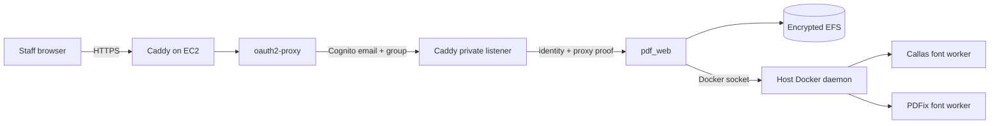

# Deploy `pdf_web` to AWS

This independent AWS production deployment runs the browser application and
its in-process PDF pipeline. It neither deploys the `pdf_api` HTTP service nor
shares infrastructure, credentials, data, or identity with Azure.

## Architecture



Route 53 points directly to an Elastic IP. Only ports 80 and 443 are open;
there is no SSH ingress. Operators and GitHub deploy through Systems Manager.
Caddy obtains and renews the public certificate through ACME.

The Cognito user pool permits administrator-created users only. oauth2-proxy
also requires the `pdf-web-users` group claim, so creating a user without
adding the group does not grant application access. TOTP is enabled but
optional; users are not forced to enroll it and this deployment adds no custom
MFA enrollment UI.

## Prerequisites

- An AWS account where the operator can deploy CloudFormation stacks and IAM
  roles, plus an authenticated AWS CLI session.
- An existing public Route 53 hosted zone.
- AWS CLI v2, `jq`, OpenSSL, and optionally GitHub CLI.
- PDFix and Callas credentials.
- A GitHub environment named `aws-production`.

## One-time bootstrap

Export inputs without placing vendor credentials in a checked-in file:

```bash
export AWS_REGION="us-west-2"
export AWS_STACK_NAME="pdf-remediation-aws"
export AWS_HOSTED_ZONE_ID="Z0123456789EXAMPLE"
export WEB_DNS_LABEL="pdf"
export ACME_EMAIL="aws-admin@example.gov"
export GITHUB_REPOSITORY="owner/pdf-remediation"
export COGNITO_INITIAL_USER_EMAIL="operator@example.gov"
export PDFIX_LICENSE_NAME="..."
export PDFIX_LICENSE_KEY="..."
export ENV_CALLAS_LICENSE="..."
export ENV_CALLAS_SECRET="..."
```

Optional sizing inputs are `NAME_PREFIX` (default `pdfremed`),
`AWS_INSTANCE_TYPE` (default `m7i.2xlarge`),
`AWS_ROOT_VOLUME_SIZE_GIB` (default `256`), and
`AWS_GITHUB_ENVIRONMENT` (default `aws-production`).

Run `./scripts/bootstrap_aws.sh`.

The bootstrap is idempotent. It deploys CloudFormation, reuses an account-level
GitHub OIDC provider when present, retrieves the generated Cognito client
secret, preserves generated proxy secrets, stores runtime values in Secrets
Manager, and invites the initial Cognito user. The invitation contains a
temporary password that must be changed at first sign-in.

Set `CONFIGURE_GITHUB=true` to populate the GitHub environment with an
authenticated `gh` session. Otherwise add these non-secret environment
variables from the stack outputs:

| Variable | Purpose |
| --- | --- |
| `AWS_DEPLOY_ROLE_ARN` | GitHub OIDC deployment role. |
| `AWS_CLOUDFORMATION_ROLE_ARN` | CloudFormation execution role. |
| `AWS_REGION` | Stack and ECR region. |
| `AWS_STACK_NAME` | Existing bootstrapped stack. |
| `AWS_HOSTED_ZONE_ID` | Existing public hosted zone. |
| `AWS_WEB_HOSTNAME` | Public smoke-test hostname. |
| `PDF_CALLAS_FONT_IMAGE` | Optional Callas worker override. |
| `PDF_PDFIX_FONT_IMAGE` | Optional PDFix worker override. |
| `PDF_WEB_MAX_CONCURRENT_JOBS` | Optional worker count override. |

No long-lived AWS access key is stored in GitHub.

## User administration

Create another invited user and authorize it with:

```bash
pool_id="$(aws cloudformation describe-stacks \
  --region "$AWS_REGION" --stack-name "$AWS_STACK_NAME" \
  --query "Stacks[0].Outputs[?OutputKey=='CognitoUserPoolId'].OutputValue | [0]" \
  --output text)"
aws cognito-idp admin-create-user \
  --region "$AWS_REGION" --user-pool-id "$pool_id" \
  --username "person@example.gov" \
  --user-attributes \
    Name=email,Value=person@example.gov \
    Name=email_verified,Value=true \
  --desired-delivery-mediums EMAIL
aws cognito-idp admin-add-user-to-group \
  --region "$AWS_REGION" --user-pool-id "$pool_id" \
  --username "person@example.gov" --group-name pdf-web-users
```

Remove application access by removing the account from the group. Existing
oauth2-proxy sessions can last up to eight hours, so use Cognito global sign-out
as well when access must end immediately.

Normal user logout is `https://<hostname>/oauth2/sign_out`. oauth2-proxy clears
its cookie and then redirects through Cognito's logout endpoint so the Cognito
managed-login session is cleared too.

## Deployment

Run **Deploy pdf_web to AWS** manually. The workflow:

1. Runs application tests, pylint, `cfn-lint`, and CloudFormation validation.
2. Creates and displays a CloudFormation change set before executing it.
3. Builds an immutable commit-SHA `linux/amd64` image and pushes it to ECR.
4. Waits for EC2 to be online in Systems Manager.
5. Deploys Caddy, oauth2-proxy, and `pdf_web` with SSM Run Command.
6. Pulls both font-worker images and runs readiness and internal auth checks.
7. Restores the previous application image if deployment health checks fail.
8. Verifies public DNS, TLS, liveness, readiness, and Cognito redirection.

The workflow is manual-only and uses the separate `aws-production` GitHub
environment. It cannot be triggered by an Azure deployment or a push to main.

## Data, secrets, and recovery

- `/mnt/pdf-data/web` and `/mnt/pdf-data/caddy` are held on encrypted EFS and
  retained if the stack is deleted.
- `/srv/pdf-remediation/scratch` uses encrypted gp3 instance storage and is
  disposable.
- `/opt/pdf-remediation-aws/.env` is generated root-only from Secrets Manager.
- EFS is mounted with TLS, IAM authorization, and UID/GID `10001`.
- AWS Backup runs daily at 05:00 UTC with 30-day retention in a locked vault.
- Cognito, EFS, the runtime secret, logs, and backups are retained on deletion.

Confirm the SNS subscription sent to `ACME_EMAIL`; alarms cover EC2 status,
sustained CPU, and root disk utilization. CloudWatch Agent publishes container
logs and host disk/memory metrics.

An interrupted queued or running job is marked failed after restart. Completed
jobs and artifacts are reloaded from EFS.

## Troubleshooting

Use Systems Manager rather than opening SSH. Principal runtime checks are:

```bash
cd /opt/pdf-remediation-aws
docker compose --env-file .env ps
docker compose --env-file .env logs --tail 200
mountpoint /mnt/pdf-data
```

If sign-in returns a group error, confirm membership in `pdf-web-users`, then
sign out and back in so Cognito issues a new token. If certificate issuance
fails, confirm the Route 53 A record points to the stack Elastic IP and ports
80/443 are reachable.
