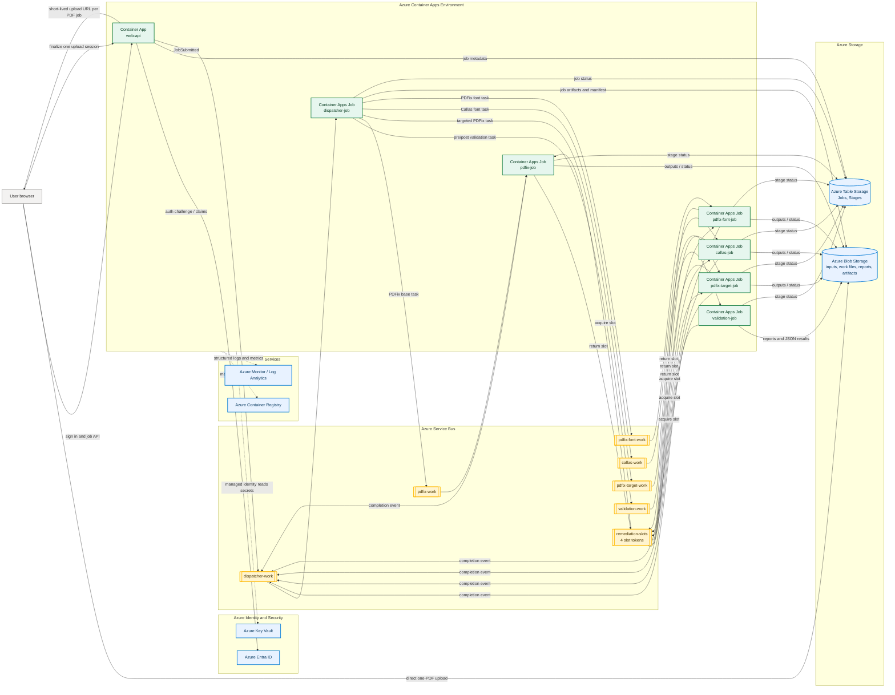

# Azure Deployment Plan for PDF Remediation

## Executive Summary

This plan describes a standalone Azure deployment for running PDF remediation as a multi-user web service.

The production architecture uses:

- One public Azure Container App for the web UI and API.
- One dispatcher job for orchestration.
- One `validation-work` queue with a high-parallelism `validation-job`.
- Separate one-PDF worker queues and jobs for PDFix, Callas, and dockerized PDFix font-fix work.
- One shared `remediation-slots` queue seeded with four slot tokens so PDFix, Callas, and PDFix font-fix share the same global 4-process budget.
- Blob Storage for uploaded files, per-job outputs, reports, manifests, and artifacts.
- Table Storage for job metadata, ownership, and stage status.
- Service Bus for queue-driven orchestration.
- Key Vault, Managed Identity, Container Registry, and Azure Monitor for secure production operation.

The public app stays lightweight, the web storage model remains separate from the local CLI workspace layout, and the shared remediation limit is enforced at the platform level instead of through in-process convention.

## Goals

The deployed system must support:

- Azure Entra ID sign-in.
- Creating one processing job per PDF.
- Allowing a multi-file browser selection only as a convenience that creates one independent job per selected PDF.
- Selecting an allowlisted remediation configuration, such as `default.json` or `default-slim.json`.
- Returning three downloadable artifacts for each job:
  - A pre-remediation veraPDF validation report.
  - The remediated PDF.
  - A post-remediation validation report.
- A shared global remediation limit of 4 concurrent processes total across:
  - PDFix SDK work using `pdf_worker.solo_fix`.
  - PDFix targeted work using `pdf_worker.solo_fix_target`.
  - Callas font work using `pdf_worker.solo_font_callas`.
  - Dockerized PDFix font-fix work using `pdf_worker.solo_font_pdfix`.
- Uncapped veraPDF validation capacity using `pdf_worker.solo_validate`, subject only to Azure quotas, configured job scale limits, and cost controls.

## Azure Architecture

### Infrastructure Diagram

This diagram shows the deployed Azure resources and the one-job-per-PDF flow. A browser multi-select repeats the upload/session path once for each selected PDF.



### Azure Resources and Quantity

Recommended baseline resources per Azure environment:

| Azure resource | Quantity | Purpose |
| --- | ---: | --- |
| Azure Entra ID app registration | 1 | Authenticates staff and exposes app roles or group-based access. |
| Azure Container Apps environment | 1 | Hosts the public app and queue-triggered job definitions. |
| Public Azure Container App, `web-api` | 1 | Serves the UI/API, creates one job per PDF, issues upload URLs, and authorizes downloads. |
| Dispatcher Container Apps Job | 1 job definition | Orchestrates each PDF job through validation, remediation, post-validation, and artifact publication. |
| Validation Container Apps Job | 1 job definition | Runs uncapped veraPDF validation capacity, bounded by configured scale and Azure quotas. |
| Remediation Container Apps Jobs | 4 job definitions | Runs PDFix base, PDFix target, Callas font, and PDFix font-fix work. |
| Azure Service Bus namespace | 1 | Hosts orchestration, work, and slot queues. |
| Service Bus queues | 7 | `dispatcher-work`, `validation-work`, `pdfix-work`, `pdfix-target-work`, `callas-work`, `pdfix-font-work`, and `remediation-slots`. |
| Remediation slot messages | 4 | Enforces the global limit of four active remediation processes. |
| Azure Storage account | 1 | Stores blobs and table entities for jobs. |
| Blob container | 1 | Stores inputs, work files, reports, remediated PDFs, and manifests. |
| Azure Table Storage tables | 2 | `Jobs` and `Stages`. |
| Azure Key Vault | 1 | Stores PDFix, Callas, and app secrets. |
| Azure Container Registry | 1 | Stores web, dispatcher, validation, and remediation worker images. |
| Log Analytics workspace | 1 | Centralizes logs and metrics. |
| Application Insights resource | 1 | Tracks app, dispatcher, worker, and user workflow telemetry. |
| Managed identities | 1 or more | Grants Azure resource access without secrets; use one shared identity or separate identities by app/job boundary. |

### Public App

Deploy a `web-api` Azure Container App with public ingress enabled.

Responsibilities:

- Serve the web UI and API.
- Enforce Azure Entra ID authentication.
- Read user identity and roles from Entra claims.
- Authorize every job, status request, and artifact download.
- Create one upload session per PDF job.
- If the user selects multiple PDFs, create one independent job draft and upload session for each file.
- Issue short-lived, job-scoped Blob upload URLs or equivalent direct-upload credentials.
- Validate selected config names against an allowlist.
- Register completed Blob uploads after the browser uploads PDFs directly to Storage.
- Create job metadata in Table Storage after upload completion is confirmed.
- Enqueue a `JobSubmitted` message to `dispatcher-work`.

The public app must not run remediation or validation subprocesses. It should remain stateless and horizontally scalable.

### Dispatcher

Deploy a `dispatcher-job` Azure Container Apps event-driven job triggered from the `dispatcher-work` queue.

Responsibilities:

- Advance job state.
- Enqueue the next validation or remediation task for the job.
- Track stage completion events.
- Decide optional stages from validation clause matches.
- Mark job failures.
- Publish downloadable artifact references for the job.
- Write `manifest.json`.

The dispatcher is the source of truth for orchestration. Workers only process one task and report the result.

### Worker Jobs

Deploy separate queue-triggered Container Apps jobs:

- `validation-job`, triggered by `validation-work`.
- `pdfix-job`, triggered by `pdfix-work`.
- `pdfix-target-job`, triggered by `pdfix-target-work`.
- `callas-job`, triggered by `callas-work`.
- `pdfix-font-job`, triggered by `pdfix-font-work`.

Each worker execution processes one job task for one PDF, writes outputs to Blob Storage, updates Table Storage, and emits a completion event back to `dispatcher-work`.

## Worker and Queue Design

### Worker Script Contracts

Use the `pdf_worker` module as the stable worker interface:

- `solo_validate <input.pdf> --report-dir <report-dir> --compact`
- `solo_fix <input.pdf> <output.pdf> --config-file <config-file> --compact`
- `solo_fix_target <input.pdf> <output.pdf> --targets <clause-test:action.json> [...] --compact`
- `solo_font_callas <input.pdf> <output.pdf> --compact`
- `solo_font_pdfix <input.pdf> <output.pdf> --compact`

Each script should:

- Accept only local input and output paths.
- Process exactly one PDF.
- Write outputs atomically.
- Emit compact machine-readable JSON on stdout.
- Write operational logs to stderr.
- Return exit code `0` for successful execution and non-zero for operational failure.

The current codebase already includes one-PDF wrappers for `solo_validate` and `solo_fix`. Before deployment, add the missing `pdf_worker` wrappers for `solo_fix_target`, `solo_font_callas`, and `solo_font_pdfix`, and wire them into `pyproject.toml` console scripts.

### Message Shape

Use compact JSON messages. Every work message should include:

- `jobId`
- `stage`
- `attempt`
- `ownerObjectId`
- `inputBlob`
- `outputBlob`
- `reportBlobPrefix`
- `configFile`, when applicable
- `targets`, when applicable
- `correlationId`

Use deterministic `messageId` values such as `{jobId}:{stage}:{attempt}` so duplicate deliveries can be ignored safely.

### Queue List

Create these Service Bus queues:

- `dispatcher-work`
- `validation-work`
- `pdfix-work`
- `pdfix-target-work`
- `callas-work`
- `pdfix-font-work`
- `remediation-slots`

Enable dead-letter queues and configure a maximum delivery count for all work queues.

## Shared 4-Process Remediation Limit

The `remediation-slots` queue enforces a global remediation budget of 4 active processes total.

Seed the queue with exactly four slot messages:

- `slot-1`
- `slot-2`
- `slot-3`
- `slot-4`

Only these stages require a slot:

- `pdfix_fix`
- `pdfix_target`
- `callas_font_fix`
- `pdfix_font_fix`

Validation never consumes a remediation slot.

### Slot Acquisition Flow

For PDFix, Callas, and PDFix-font workers:

1. Receive one work message from the stage queue using peek-lock mode.
2. Receive one slot message from `remediation-slots` using peek-lock mode.
3. Start the one-PDF worker process.
4. Renew both the work-message lock and slot-message lock while processing.
5. If lock renewal fails, terminate the subprocess and abandon the work message.
6. On success, upload outputs and update Table Storage.
7. In one Service Bus transaction:
   - Complete the work message.
   - Complete the consumed slot message.
   - Send a replacement slot message.
   - Send the stage completion event to `dispatcher-work`.

This keeps the slot count stable and prevents more than 4 remediation subprocesses from running across all remediation worker types.

### Crash Behavior

If a worker crashes after acquiring a slot:

- The work message lock eventually expires and the task is redelivered.
- The slot message lock eventually expires and the slot becomes available again.
- Idempotent blob paths and deterministic message IDs prevent duplicate final results.

If a worker completes processing but fails during final settlement:

- The task may be redelivered.
- The worker must check Table Storage and Blob Storage before rerunning.
- If the stage is already complete, it should complete the duplicate message and emit or confirm the existing completion event.

## Job Flow

1. User signs in with Azure Entra ID.
2. User creates a job draft for one PDF and selects a remediation config.
3. If the user selected multiple PDFs in the browser, `web-api` creates one independent job draft per file.
4. `web-api` validates the config and creates a short-lived, job-scoped Blob upload URL for each job.
5. The browser uploads each PDF directly to Blob Storage under `jobs/{jobId}/input/{filename}`. PDF bytes do not pass through the Container App.
6. The browser calls `web-api` to finalize each upload session with file name, blob path, size, and checksum.
7. `web-api` verifies the expected blob exists, creates a `Jobs` table row, and enqueues `JobSubmitted` to `dispatcher-work`.
8. Dispatcher enqueues one `pre_validation` task for the job to `validation-work`.
9. `validation-job` runs `pdf_worker.solo_validate` and uploads pre-remediation report artifacts.
10. Dispatcher enqueues one `pdfix_fix` task to `pdfix-work`.
11. `pdfix-job` runs `pdf_worker.solo_fix` under the 4-slot remediation gate.
12. Dispatcher uses pre-validation clause matches to decide optional stages:
    - Enqueue `callas_font_fix` to `callas-work` for configured Callas font identifiers.
    - Enqueue `pdfix_font_fix` to `pdfix-font-work` for configured missing-Unicode identifiers.
    - Enqueue `pdfix_target` to `pdfix-target-work` for configured target mappings.
13. Remediation workers process optional stages under the same 4-slot remediation gate.
14. Dispatcher enqueues one `post_validation` task for the job's final candidate PDF to `validation-work`.
15. `validation-job` runs `pdf_worker.solo_validate` and uploads post-remediation report artifacts.
16. Dispatcher confirms the job's downloadable artifact paths:
    - Pre-remediation validation report artifact.
    - Remediated PDF artifact.
    - Post-remediation validation report artifact.
17. Dispatcher writes `manifest.json` with job artifact paths.
18. Dispatcher marks the job `Completed` or `CompletedWithErrors`.
19. User downloads the job's pre-validation report, remediated PDF, and post-validation report from the web UI.

## Storage Model

### Blob Storage

Use one storage account container for job artifacts, with this path layout:

```text
jobs/{jobId}/input/{filename}
jobs/{jobId}/work/{stage}/{filename}
jobs/{jobId}/reports/pre/...
jobs/{jobId}/outputs/{filename}
jobs/{jobId}/reports/post/...
jobs/{jobId}/manifest.json
```

Workers should download inputs to local scratch storage, run the `pdf_worker` script, upload outputs, and delete scratch files after completion.

### Table Storage

Use Table Storage for operational metadata.

`Jobs` table:

- `PartitionKey`: `ownerObjectId`
- `RowKey`: `jobId`
- `status`
- `configFile`
- `createdAt`
- `startedAt`
- `completedAt`
- `originalFilename`
- `inputBlob`
- `currentBlob`
- `finalBlob`
- `preValidationStatus`
- `preValidationReportBlobPrefix`
- `postValidationStatus`
- `postValidationReportBlobPrefix`
- `stageSummary`
- `manifestBlobPath`
- `error`

`Stages` table:

- `PartitionKey`: `jobId`
- `RowKey`: `{stage}:{attempt}`
- `status`
- `workerKind`
- `startedAt`
- `completedAt`
- `inputBlob`
- `outputBlob`
- `reportBlobPrefix`
- `error`

Store large validation details, raw JSON, XML reports, and generated report files in Blob Storage. Keep Table entities small.

### Manifest

Write `jobs/{jobId}/manifest.json` with:

- Job metadata.
- Selected config.
- User-visible job status.
- Input filename.
- Artifact paths: pre-validation report, remediated PDF, and post-validation report.
- Stage statuses.
- Error, if any.

## Security and Operations

### Identity and Access

- Use Azure Container Apps built-in authentication with Microsoft Entra ID for `web-api`.
- Use managed identity for `web-api`, dispatcher, and workers.
- Use Azure RBAC for Blob Storage, Table Storage, Service Bus, Key Vault, and Container Registry.
- Do not store storage account keys or Service Bus connection strings in application settings.
- Store PDFix and Callas license secrets in Key Vault.
- Issue short-lived download URLs only after API authorization.

### Networking

- Public ingress is enabled only for `web-api`.
- Dispatcher and worker jobs have no public ingress.
- Prefer private endpoints for Storage, Service Bus, Key Vault, and Container Registry when deploying into a locked-down virtual network.

### Container Images

Build separate images for:

- `web-api`
- `dispatcher`
- `validation-worker`
- `pdfix-worker`
- `pdfix-target-worker`
- `callas-worker`
- `pdfix-font-worker`

Avoid Docker-in-Docker in Azure Container Apps. For Callas and PDFix font-fix work, create dedicated worker images from the vendor images or from equivalent base images that already contain the required binaries. Add the queue runner and `pdf_worker` code to those images and invoke the remediation command directly.

### Monitoring

Use Azure Monitor, Log Analytics, and Application Insights with structured logs containing:

- `jobId`
- `stage`
- `attempt`
- `workerKind`
- `correlationId`
- `slotId`, for remediation workers

Create alerts for:

- Dead-letter queue depth greater than zero.
- Jobs stuck in running states.
- Remediation slot replacement failures.
- Validation failure spikes.
- Worker crash loops.
- Long-running remediation stages.
- Storage upload or job artifact publication failures.

### Retention

Configure lifecycle policies for:

- Uploaded PDFs.
- Scratch outputs.
- Reports.
- Per-job report and PDF artifacts.
- Logs.

Retention should be environment-specific. Production retention should be long enough for user downloads, audit, and support, but not indefinite unless required by policy.

## Test Plan

### Authentication and Authorization

- Entra sign-in works.
- An unauthenticated user cannot access the app.
- A user cannot read another user's job or artifacts.
- An admin role can inspect all jobs, if admin access is enabled.

### Upload and Job Creation

- A single PDF creates exactly one processing job.
- Selecting multiple PDFs creates multiple independent jobs, one per file.
- PDF bytes upload directly from the browser to Blob Storage, not through `web-api`.
- Upload session finalization rejects missing blobs, mismatched sizes, or mismatched checksums.
- Unsupported extensions are rejected.
- Non-allowlisted config names are rejected.
- `default.json` and `default-slim.json` are accepted.
- A submitted job creates Blob Storage and Table Storage records.

### Worker Contracts

- `pdf_worker.solo_validate` succeeds with a local input PDF and report directory.
- `pdf_worker.solo_fix` succeeds with local input/output paths and a config file.
- `pdf_worker.solo_fix_target` succeeds with local input/output paths and target mappings.
- `pdf_worker.solo_font_callas` succeeds with local input/output paths.
- `pdf_worker.solo_font_pdfix` succeeds with local input/output paths.
- Every script emits compact JSON and returns meaningful exit codes.

### Concurrency

- Submit enough jobs to populate all remediation queues.
- Confirm no more than 4 total remediation processes run across `pdfix-job`, `pdfix-target-job`, `callas-job`, and `pdfix-font-job`.
- Confirm validation work continues to scale while all 4 remediation slots are occupied.
- Confirm slot messages return after successful processing.
- Confirm slot messages become available again after worker crashes or lock expiry.

### Failure Handling

- Crash a worker after acquiring a slot.
- Crash a worker after uploading output but before Service Bus settlement.
- Send malformed work messages and confirm they dead-letter.
- Submit a PDF that fails PDFix processing and confirm the file is marked failed without blocking the whole job.
- Submit a PDF that fails validation and confirm reports are still available.

### Artifact Acceptance

- Completed jobs expose three downloadable artifact types for the job's PDF:
  - Pre-remediation validation report artifact.
  - Remediated PDF artifact.
  - Post-remediation validation report artifact.
- `manifest.json` lists the input file, stage results, final output, reports, and errors.
- Job artifact paths preserve filenames where possible and disambiguate duplicates safely across jobs.

## Assumptions

- Azure Entra ID is single-tenant by default. Multi-tenant or B2B access can be added later without changing the queue and storage design.
- Service Bus Standard or Premium is used because the remediation slot release flow depends on Service Bus transactions.
- Validation capacity is uncapped by application logic, but still bounded by Azure quotas, configured Container Apps job max executions, CPU allocation, and cost controls.
- The three missing `pdf_worker` wrappers are implemented before deployment.
- The selected remediation config applies to the base PDFix stage for the job's PDF.
- Optional Callas, PDFix font-fix, and targeted PDFix stages are driven by pre-validation clause matches.
- README remains unchanged.

## Azure References

- [Azure Container Apps jobs](https://learn.microsoft.com/en-us/azure/container-apps/jobs)
- [Azure Container Apps authentication](https://learn.microsoft.com/en-us/azure/container-apps/authentication)
- [Enable authentication and authorization in Azure Container Apps with Microsoft Entra ID](https://learn.microsoft.com/en-us/azure/container-apps/authentication-entra)
- [Managed identities in Azure Container Apps](https://learn.microsoft.com/en-us/azure/container-apps/managed-identity)
- [Set scaling rules in Azure Container Apps](https://learn.microsoft.com/en-us/azure/container-apps/scale-app)
- [Azure Service Bus message sessions](https://learn.microsoft.com/en-us/azure/service-bus-messaging/message-sessions)
- [Azure Service Bus transactions](https://learn.microsoft.com/en-us/azure/service-bus-messaging/service-bus-transactions)
- [Azure Service Bus message transfers, locks, and settlement](https://learn.microsoft.com/en-us/azure/service-bus-messaging/message-transfers-locks-settlement)
- [Azure Service Bus dead-letter queues](https://learn.microsoft.com/en-us/azure/service-bus-messaging/service-bus-dead-letter-queues)
- [Azure Table Storage overview](https://learn.microsoft.com/en-us/azure/storage/tables/table-storage-overview)
