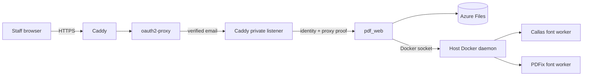

# Deploy `pdf_web` to Azure

This deployment runs the browser application and its PDF pipeline on one
Ubuntu VM. `pdf_web` imports `pdf_api.pipeline` as a Python library; it does not
start or publish the `pdf_api` HTTP service.

## Architecture



Only ports 80 and 443 are reachable from the internet. The application and
oauth2-proxy ports exist only on private Docker networks. Caddy's private
listener adds the shared proof header after oauth2-proxy authenticates the
request, so a caller cannot become another job owner by supplying an identity
header directly.

Granting the application container access to `/var/run/docker.sock` is
equivalent to granting host-root control. This is necessary for the existing
font workers and is why the VM must run only this trusted application.

## Prerequisites

- An Azure subscription and tenant where the operator may create resource
  groups, role assignments, app registrations, and service principals.
- An existing public Azure DNS zone.
- Azure CLI, `jq`, OpenSSL, and an authenticated `az login` session.
- A break-glass SSH public key. Port 22 is not exposed, but Azure requires a
  login credential and the key remains useful through Bastion or a private
  network.
- PDFix and Callas license values.
- A GitHub environment named `production` for this repository.

## One-time bootstrap

Export the inputs without placing license values in a checked-in file:

```bash
export AZURE_SUBSCRIPTION_ID="00000000-0000-0000-0000-000000000000"
export AZURE_RESOURCE_GROUP="pdf-remediation-prod"
export AZURE_LOCATION="westus2"
export AZURE_DNS_ZONE_RESOURCE_ID="/subscriptions/.../resourceGroups/dns-rg/providers/Microsoft.Network/dnsZones/example.gov"
export WEB_DNS_LABEL="pdf"
export ACME_EMAIL="azure-admin@example.gov"
export ADMIN_SSH_PUBLIC_KEY="$(< ~/.ssh/id_ed25519.pub)"
export GITHUB_REPOSITORY="owner/pdf-remediation"
export GITHUB_ENVIRONMENT="production"
export PDFIX_LICENSE_NAME="..."
export PDFIX_LICENSE_KEY="..."
export ENV_CALLAS_LICENSE="..."
export ENV_CALLAS_SECRET="..."
```

Run:

```bash
./scripts/bootstrap_azure.sh
```

The script is safe to re-run. It deploys the Azure foundation, creates or
updates the single-tenant Entra application, requires enterprise-application
assignment, configures the GitHub workload identity, and stores runtime
credentials in Key Vault. It does not print secret values.

To let the script populate the GitHub `production` environment using an
authenticated GitHub CLI session, also set:

```bash
export CONFIGURE_GITHUB=true
```

Otherwise configure these values manually:

| Kind | Name |
| --- | --- |
| Secret | `AZURE_CLIENT_ID` |
| Secret | `AZURE_TENANT_ID` |
| Secret | `AZURE_SUBSCRIPTION_ID` |
| Secret | `ADMIN_SSH_PUBLIC_KEY` |
| Variable | `AZURE_RESOURCE_GROUP` |
| Variable | `AZURE_LOCATION` |
| Variable | `AZURE_DNS_ZONE_RESOURCE_ID` |
| Variable | `WEB_DNS_LABEL` |
| Variable | `NAME_PREFIX` |
| Variable (optional) | `PDF_CALLAS_FONT_IMAGE` |
| Variable (optional) | `PDF_PDFIX_FONT_IMAGE` |

In Entra ID, open the **PDF Remediation Web** enterprise application and
assign the permitted users or groups. Unassigned tenant users cannot sign in.

## Deployment

Push to `main` or run **Deploy pdf_web to Azure** manually. The workflow:

1. Runs unit tests and pylint.
2. Builds and deploys the Bicep resources.
3. Builds an immutable commit-tagged image inside ACR.
4. Uses Azure VM Run Command, not SSH, to mount storage and deploy Compose.
5. Pulls the pinned Callas and PDFix worker images.
6. Runs readiness and authenticated application checks.
7. Restores the previous application image if readiness fails.

The final address is `https://<WEB_DNS_LABEL>.<DNS_ZONE>`.

## Runtime data and secrets

- `/mnt/pdf-data/web` is the Azure Files-backed job store.
- `/mnt/pdf-data/caddy` persists certificates and Caddy state.
- `/srv/pdf-remediation/scratch` is host-local disposable working storage. It
  is mounted at the same absolute path in `pdf_web`, which lets the host Docker
  daemon bind it into font-worker containers.
- `/opt/pdf-remediation/.env` is generated root-only from Key Vault values.
- `/var/run/docker.sock` is mounted into `pdf_web`; its numeric group ID is
  discovered during every deployment.
- `PDF_CALLAS_FONT_IMAGE` and `PDF_PDFIX_FONT_IMAGE` optionally override the
  pinned worker tags; leaving them unset uses the tested production defaults.

Azure Files soft delete and daily 30-day Recovery Services protection are
created by Bicep. An interrupted queued or running job is marked failed after
a VM or application restart; completed jobs and artifacts remain available.

## Health and troubleshooting

`/healthz` checks that the web scheduler is alive. `/readyz` additionally
requires Java, veraPDF, configuration files, both licenses, Docker, both font
images, writable storage, and at least 1 GiB of scratch free space. Both public
responses intentionally omit dependency names and secret details. Signed-in
users can view the detailed checks at `/api/health`.

Useful commands through Azure Run Command include:

```bash
cd /opt/pdf-remediation
docker compose --env-file .env ps
docker compose --env-file .env logs --tail 200
```

If certificates are not issued, confirm that the Azure DNS A record resolves
to the VM public IP and ports 80/443 are reachable. If sign-in loops, confirm
the Entra redirect URI is exactly
`https://<hostname>/oauth2/callback` and that the user is assigned to the
enterprise application.

## Restore

Restore deleted or damaged job data from the Recovery Services vault into the
original `pdf-data` share or an alternate share. Re-running Bicep and the
deployment workflow recreates the stateless VM/container layer. Restored job
metadata is loaded the next time `pdf_web` starts.

Rotating a PDFix, Callas, or oauth2-proxy secret requires updating its Key
Vault entry and re-running the deployment workflow. Rotating the Entra client
secret also requires adding a new app-registration credential before replacing
`entra-client-secret` in Key Vault.
