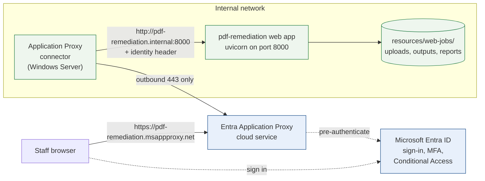

# Deploying behind Microsoft Entra Application Proxy

This guide publishes the PDF remediation web app to staff through Entra
Application Proxy, so users sign in with their existing Entra accounts and
Conditional Access and MFA apply.

The application does not authenticate anyone itself. It reads the signed-in
user from a header and trusts that header only when the request provably came
from the proxy. Everything below exists to make that proof real.

---

## Before you start

**Confirm what Application Proxy forwards to the backend.** This is the one
question that decides the whole deployment, and it depends on the
pre-authentication and single sign-on mode you configure. In passthrough mode
the proxy authenticates the user at the edge but forwards **no identity** to
the backend; header-based single sign-on is what supplies one, and on some
tenants that capability is delivered through the Microsoft partnership with
PingAccess rather than by Application Proxy alone.

Rather than take this guide's word for it, measure it. Step 4 below turns on a
diagnostic endpoint that reports exactly which headers arrive. **Do that before
building anything else** — if no identity header arrives, stop and read
*If no identity arrives* at the end.

You will need:

- An Entra tenant with Application Proxy enabled, and permission to publish an
  enterprise application.
- A Windows Server on the internal network for the Application Proxy connector.
  It needs outbound HTTPS to the Entra service; **no inbound firewall openings
  are required.**
- A Linux or macOS host on the internal network to run this application, with
  Java, Docker, and the PDFix and Callas licences configured as described in
  the main README.

---

## Architecture



The connector is the **only** host that can reach the application. That fact is
what makes a forwarded identity header believable, and it is what the source
allowlist in step 3 enforces.

---

## 1. Install the Application Proxy connector

On the Windows Server, install the connector from the Entra admin centre under
**Application proxy → Download connector service**, and confirm it appears as
*Active* in the connector group you intend to use.

Note the server's internal IP address. You will need it in step 3, and if the
connector group has several servers you need every one of them.

---

## 2. Run the application as a service

Run the app on the internal host, bound to an interface the connector can
reach. Use a dedicated account that owns the repository and the job directory.

`/etc/systemd/system/pdf-remediation-web.service`:

```ini
[Unit]
Description=PDF Remediation web app
After=network-online.target docker.service
Wants=network-online.target

[Service]
Type=simple
User=pdfremediation
WorkingDirectory=/opt/pdf-remediation
Environment=PDF_WEB_TRUSTED_PROXY_IPS=10.20.0.11/32
Environment=PDF_WEB_IDENTITY_HEADER=x-forwarded-email
Environment=PDF_WEB_JOB_TTL_HOURS=168
ExecStart=/usr/local/bin/uv run web --host 0.0.0.0 --port 8000 --allow-remote
Restart=on-failure
RestartSec=5

# The job directory is the only path the service needs to write.
ProtectSystem=strict
ProtectHome=yes
PrivateTmp=yes
NoNewPrivileges=yes
ReadWritePaths=/opt/pdf-remediation/resources/web-jobs

[Install]
WantedBy=multi-user.target
```

```bash
sudo systemctl daemon-reload
sudo systemctl enable --now pdf-remediation-web
journalctl -u pdf-remediation-web -n 20
```

The startup line states the mode it came up in. Expect:

```
PDF Remediation Web: multi-user mode on 0.0.0.0:8000; identity from
x-forwarded-email; trust via source allowlist.
```

If it says **single-user mode**, or refuses to start, the trust configuration
is missing — see *Troubleshooting*.

---

## 3. Configure trust

Application Proxy in passthrough mode cannot add a custom header to requests,
so the shared-secret mechanism used with oauth2-proxy is unavailable here.
Trust comes from the source address instead: only the connector can reach the
application, so only the connector may assert an identity.

| Variable | Value | Purpose |
|---|---|---|
| `PDF_WEB_TRUSTED_PROXY_IPS` | connector IPs or CIDRs, comma-separated | Only these sources may assert an identity |
| `PDF_WEB_IDENTITY_HEADER` | header names, comma-separated, first match wins | Which header carries the signed-in user |

Set `PDF_WEB_TRUSTED_PROXY_IPS` to **every** connector in the group. A
malformed entry is skipped rather than trusted, and the valid entries continue
to apply.

**This allowlist is the whole security boundary.** Anything that can reach
port 8000 from an allowlisted address can claim to be any user, so make sure
nothing else runs on the connector host and that host-level firewall rules
restrict port 8000 to the connector addresses:

```bash
sudo ufw allow from 10.20.0.11 to any port 8000 proto tcp
sudo ufw deny 8000
```

If your topology puts another hop between the connector and the app, allowlist
that hop's address instead — the check sees the immediate peer.

---

## 4. Publish the application and confirm the identity header

In the Entra admin centre, add an on-premises application:

| Setting | Value |
|---|---|
| Internal URL | `http://pdf-remediation.internal:8000` |
| External URL | assigned, or your own verified domain |
| Pre Authentication | **Microsoft Entra ID** — never Passthrough, which would publish it unauthenticated |
| Connector Group | the group containing the connector from step 1 |

Assign the staff who should have access under **Users and groups**. Access is
per-user; there is no admin role in the application.

Now confirm what actually reaches the backend. Enable the diagnostic
temporarily:

```bash
sudo systemctl edit pdf-remediation-web
# add:  [Service]
#       Environment=PDF_WEB_HEADER_DIAGNOSTIC=1
sudo systemctl restart pdf-remediation-web
```

Sign in through the external URL and visit `/api/proxy-headers`. It reports
every header that arrived, with credential values redacted:

```json
{
  "source_address": "10.20.0.11",
  "source_trusted": true,
  "identity_headers_checked": ["x-forwarded-email"],
  "identity_headers_found": {"x-forwarded-email": "alice@courts.ca.gov"},
  "resolved_user": "alice@courts.ca.gov",
  "would_authenticate": true
}
```

Read `headers` in the response to find which header actually carries the user,
then set `PDF_WEB_IDENTITY_HEADER` to that name. Several names may be listed
and the first present one wins, which is useful while you are still
determining it:

```
Environment=PDF_WEB_IDENTITY_HEADER=x-ms-client-principal-name,x-forwarded-email
```

**Turn the diagnostic off when you are done.** It is reachable without
authenticating — that is what makes it useful when authentication is broken —
and the service logs a warning on every start while it is enabled.

```bash
sudo systemctl revert pdf-remediation-web
sudo systemctl restart pdf-remediation-web
```

Confirm it is off: `/api/proxy-headers` must return **404**.

---

## 5. Verify

| Check | Expectation |
|---|---|
| Sign in at the external URL | The page loads and shows *Signed in as you@courts.ca.gov* |
| `curl http://pdf-remediation.internal:8000/api/health` from a non-connector host | `403`, refused by the source allowlist |
| Same request with a forged identity header | `403` — the address is what is checked, not the header |
| Submit a small PDF | Runs the seven pipeline steps and offers downloads |
| Open a colleague's job link | Not available; jobs are private to whoever submitted them |
| `/api/proxy-headers` | `404` once the diagnostic is off |

---

## Troubleshooting

**The service refuses to start,** reporting that no proxy trust is configured.
`--allow-remote` was passed without `PDF_WEB_TRUSTED_PROXY_IPS` or
`PDF_WEB_PROXY_SECRET`. The application will not serve a remote interface
without a way to tell proxied requests from direct ones.

**Every request returns 403.** The source address is not in the allowlist. Turn
the diagnostic on and read `source_address` — it is often a different interface
on the connector host than expected, or a hop you did not know was there.

**Every request returns 401,** saying no usable identity was forwarded. The
proxy reached the app but sent no identity header. Read `headers` in the
diagnostic: if a header carries the user under another name, set
`PDF_WEB_IDENTITY_HEADER`. If none does, see below.

**Everyone appears as the same user.** `PDF_WEB_IDENTITY_HEADER` is pointing at
a static header rather than a per-user one. Check the diagnostic with two
different people signed in.

**Jobs from before this deployment are not visible.** Job directories created
before ownership existed have no owner and are unreachable by default. Set
`PDF_WEB_LEGACY_JOB_OWNER` to adopt them, or delete them.

### If no identity arrives

The diagnostic shows `source_trusted: true` but `identity_headers_found: {}`.
The proxy is reaching the app and forwarding no user, which means the
single sign-on mode does not do header-based SSO. Options, roughly in order of
effort:

1. **Configure header-based single sign-on** for the published application, if
   your tenant offers it, and point `PDF_WEB_IDENTITY_HEADER` at the header it
   sends. On some tenants this is provided through PingAccess, which is a
   licensed component.
2. **Put oauth2-proxy on the internal host**, configured with Entra ID as its
   OIDC provider, and have Application Proxy forward to oauth2-proxy rather
   than to this app. Users still sign in with Entra; oauth2-proxy supplies
   `X-Forwarded-Email` and can set the shared secret header, so
   `PDF_WEB_PROXY_SECRET` becomes usable as a second proof alongside the
   address allowlist.
3. **Add OpenID Connect to the application itself.** This is a real feature,
   not a configuration change: sessions, token validation, and sign-out all
   have to be built and maintained here rather than in software designed for
   it. Prefer either option above.

Option 2 keeps this application's design intact and is usually the shortest
path when header-based SSO is unavailable.
